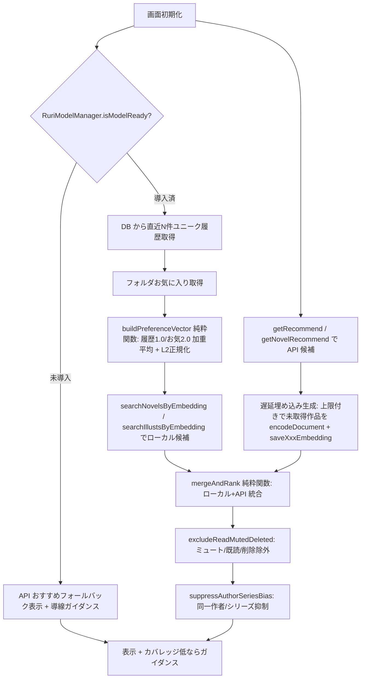

# PixEmber Phase 1「AIレコメンドフィード」実装設計

> 目的: ユーザーの閲覧履歴・お気に入りから埋め込みベクトル（好みプロファイル）を合成し、
> ローカル作品 + pixiv API おすすめを統合した「AI レコメンドフィード」を提供する。
> 本ドキュメントは調査ベースの設計書。コード変更は行わない。

---

## 0. 設計制約（必須要件の整理）

1. 小説用・イラスト用の**好みベクトルを別々に保持**（混合しない）。
2. 履歴から**直近 N 件の重複排除ユニーク**作品を採用。
3. 重み: 履歴 = `1.0` / お気に入り = `2.0`（**SharedPreferences で設定可能**）。
4. 加重平均後に **L2 正規化**する。
5. API おすすめ + ローカル候補を**統合**して表示。
6. API 候補のうち埋め込み未生成作品は**遅延生成**（件数上限あり、UI 非ブロック）。
7. 既読 / ミュート / 削除済みを**除外**。
8. 同一作者・同一シリーズの偏りを**抑制**（バリエーション確保）。
9. **AI モデル未導入時は pixiv API おすすめへフォールバック**。
10. 埋め込みカバレッジが低い場合は**導線ガイダンス**を表示。
11. **RerankService は使用しない**（テキストクエリが定義できないため）。
12. `RecommendationService` を UI から分離し、主要計算を**純粋関数**化して単体テスト可能にする。

---

## 1. 現行 HEAD 再確認結果（9 項目）

### 項目1: `database_search.dart` 検索シグネチャ・返却モデル
再利用するローカル類似検索:
```dart
// database_search.dart
Future<List<Map<String, dynamic>>> searchNovelsByEmbedding({
  required Database db,
  required Float32List userEmbedding,
  int limit = 20,
  double minSimilarity = 0.5,
})  // 返却: [...novels行 + {'similarity': double}]

Future<List<Map<String, dynamic>>> searchIllustsByEmbedding({
  required Database db,
  required Float32List userEmbedding,
  int limit = 20,
  double minSimilarity = 0.5,
})  // 返却: [...illusts行 + {'similarity': double}]
```
- 内部で `Isolate.run` + バッチ(100) + `_BoundedTopHeap` によるコサイン類似度を計算。
- モデル互換フィルタ（`model_id` / `version` / `prefix`）により非互換ベクトルは自動スキップ。
- **純粋関数化できる計算**: コサイン類似度（`_cosineSimilarity` / `_vectorNorm` を public 化または同じロジックを `recommendation_math.dart` に複製）。

### 項目2: history → work_id/type 最新順 重複排除取得 API
- 現状: `database_history.dart` の `searchHistory({db, keyword, type, limit=100, offset=0})`
  は `ORDER BY created_at DESC LIMIT ? OFFSET ?` のみ。**work_id 単位の重複排除 API は存在しない。**
- **新規追加が必要**: `searchDistinctHistoryByWork({db, type, limit})` を `database_history.dart` に追加。
  例: `SELECT * FROM history WHERE type=? GROUP BY work_id ORDER BY MAX(created_at) DESC LIMIT ?`
  （SQLite の `GROUP BY work_id` + `ORDER BY MAX(created_at)` で直近ユニークを取得）。

### 項目3: folder_items / mutes / embeddings 取得 API
- `getFolderItems({folderId, type, limit=50, offset=0})` → `folder_items` から取得（お気に入り判定に使用）。
- `getMutesList()` → `mutes` 全件（`author_id` / `tag` / `work_id` で除外）。
- `novel_embeddings` / `illust_embeddings` は直接 SELECT せず、`searchNovelsByEmbedding` / `searchIllustsByEmbedding` 経由で利用。
- 埋め込み存在判定: `getWorkIdsWithoutEmbedding(List<int>)` / `getIllustIdsWithoutEmbedding(List<int>)` を遅延生成で使用。

### 項目4: API 取得 Illust/Novel → illusts/novels 保存フロー
- `saveNovel(Novel)` / `saveIllustMeta(Illust)` でメタ保存。
- 埋め込み: `saveNovelEmbedding({workId, embedding})` / `saveIllustEmbedding({workId, embedding})`。
- ホーム画面では小説一覧取得後に `_generateEmbeddingsInBackground(novels)` を呼んでいる（[`home_screen_state.dart:607-609`](pixiv_viewer/lib/screens/home_screen_state.dart:607)）。
  → レコメンドでも同パターン（API 候補を受け取った直後にバックグラウンド生成）を踏襲。

### 項目5: getRecommend / getNovelRecommend ページング・保存
- `getRecommend({offset=0})` / `getNovelRecommend({offset, startTextLength, endTextLength})`
  は `FetchResult<T>{items, nextUrl, nextOffset, hasNext}` を返却。
- ページング: `nextOffset` が null でなければ `fetchNextPage()` で追加（[`home_screen_state.dart:799-936`](pixiv_viewer/lib/screens/home_screen_state.dart:799)）。
- レコメンドでも同じ `nextOffset` 方式で無限スクロール + 取得済み作品の遅延埋め込み生成を適用。

### 項目6: モデル導入判定 + モデル管理画面遷移
- 判定: `RuriModelManager().isModelReady()` （[`ruri_model_manager.dart:288`](pixiv_viewer/lib/services/ruri_model_manager.dart:288)）
- 初期化: `EmbeddingService().initialize()` → `isInitialized` / `initError`。
- 管理画面遷移: `Navigator.push(context, MaterialPageRoute(builder: (_) => const AiIndexMaintenanceScreen()))`
  （[`feeling_discovery_screen.dart:703-707`](pixiv_viewer/lib/screens/feeling_discovery_screen.dart:703) と同一パターン）。
- 未導入時は当画面への導線ボタンをフィード上部に表示し、タップで管理画面へ。

### 項目7: 設定永続化
- 既存: `FeatureFlags`（コンパイル時 `--dart-define`）、`SharedPreferences` 自前キー
  （`PIXIV_REFRESH_TOKEN`, `GOOGLE_DRIVE_LAST_SYNC`, `search_history`, `novel_bookmark_ids`, `ruri_active_model_id`）。
- 新規キー提案（[`feature_flags.dart`](pixiv_viewer/lib/config/feature_flags.dart) または専用 prefs ヘルパー）:
  - `recfeed_history_weight` (double, 既定1.0)
  - `recfeed_favorite_weight` (double, 既定2.0)
  - `recfeed_history_limit` (int, 直近N件 既定30)
  - `recfeed_min_similarity` (double, 既定0.5)
  - `recfeed_enabled` (bool, 既定true)
  - `recfeed_defer_embed_gen_limit` (int, 遅延生成上限 既定50)

### 項目8: ホーム拡張ナビ（非肥大化）
- 現在のボトムナビ: `illustIndex=0 / novelIndex=1 / feelingDiscoveryIndex=2`
  （[`home_screen_state.dart:155-158`](pixiv_viewer/lib/screens/home_screen_state.dart:155)）。
- `FeelingDiscoveryScreen` は第3タブとして独立画面として埋め込み済み
  （[`home_screen_state.dart:1679-1680`](pixiv_viewer/lib/screens/home_screen_state.dart:1679)）。
- **推奨**: 第4タブ `recommendIndex=3` として `AiRecommendFeedScreen` を独立画面として追加。
  `currentIndex` と `NavigationDestination` を 1 箇所ずつ拡張するだけで済む（既存パターンの踏襲）。

### 項目9: Drive バックアップ対象テーブル
- バックアップ = `DatabaseService().exportAllData()`（[`google_drive_service.dart:103-140`](pixiv_viewer/lib/services/google_drive_service.dart:103)）。
- 現状の対象: `history, novels, novel_text, novel_embeddings, downloaded_illust, mutes, folders, folder_items, subscribed_tags, read_later, search_history`。
- **不足**: `illusts` と `illust_embeddings` が含まれていない（イラスト意味検索の成果が同期されない）。
- レコメンド用に新テーブル（後述 `recommend_feed_cache` 等）を追加する場合は `exportAllData` / `importAllData` へも追加登録が必要。

---

## 2. データフロー（候補 → 表示）



---

## 3. クラス・データモデル提案

### 3.1 `lib/services/recommendation_math.dart`（純粋関数・単体テスト向け）
```dart
// 履歴/お気に入り行から好みベクトルを合成
Float32List buildPreferenceVector({
  required List<Float32List> historyVectors,   // 順序 = 新→旧
  required List<Float32List> favoriteVectors,
  required double historyWeight,                // 既定 1.0
  required double favoriteWeight,               // 既定 2.0
});

// 加重平均後に L2 正規化（0 ベクトルならそのまま返す）
Float32List l2Normalize(Float32List v);

// コサイン類似度（database_search の _cosineSimilarity を public 化または複製）
double cosineSimilarity(Float32List a, Float32List b);

// ローカル + API 候補の統合スコア計算
List<RecommendCandidate> mergeAndRank({
  required List<Map<String, dynamic>> localNovels,
  required List<Map<String, dynamic>> localIllusts,
  required List<Novel> apiNovels,
  required List<Illust> apiIllusts,
  required Float32List userNovelVec,
  required Float32List userIllustVec,
  required double apiFallbackWeight,            // API 候補の初期スコア
});

// 同一作者/シリーズの偏り抑制（出現数に応じスコア逓減）
List<RecommendCandidate> suppressAuthorSeriesBias(List<RecommendCandidate> input);
```

### 3.2 `lib/services/recommendation_service.dart`（UI 非依存のオーケストレーター）
```dart
class RecommendationService {
  // 小説・イラストそれぞれの好みベクトルを取得（キャッシュ付き）
  Future<(Float32List? novelVec, Float32List? illustVec)> loadPreferenceVectors();

  // メイン: フィード候補を構築（ローカル + API 統合）
  Future<RecommendFeedResult> buildFeed({
    required int pageSize,
    CancelToken? cancel,
  });

  // 埋め込みカバレッジ率を計算（ガイダンス表示用）
  Future<double> embeddingCoverageRatio();
}
```

### 3.3 データモデル
```dart
class RecommendCandidate {
  final int workId;
  final String type;            // 'novel' | 'illust'
  final double score;           // 統合スコア
  final String? source;         // 'local' | 'api'
  final Map<String, dynamic> row;
}

class RecommendFeedResult {
  final List<RecommendCandidate> candidates;
  final bool modelReady;
  final double coverageRatio;   // 0.0-1.0
  final bool isFallback;        // API のみフォールバック
}
```

### 3.4 UI: `lib/screens/ai_recommend_feed_screen.dart`
- `FeelingDiscoveryScreen` と同様の `StatefulWidget` + `setState` パターン。
- `NovelListCard`（[`novel_list_card.dart:17`](pixiv_viewer/lib/widgets/novel_list_card.dart:17)）をイラスト用にも拡張、または共通カードを新設。
- モデル未導入 / カバレッジ低: 上部バナーで `AiIndexMaintenanceScreen` への導線を表示。

---

## 4. キャッシュの要否と期限

- **好みベクトルキャッシュ**: 履歴/お気に入り変更時またはモデル切替時に無効化。
  `RuriModelManager.embeddingModelId` をキーに `Map<String, Float32List>` メモリキャッシュ。
  オンディスク保存は不要（再計算コストは許容範囲、かつモデル互換性考慮）。
- **フィード候補キャッシュ**: 同一セッション内のみメモリ保持（スクロール復帰用）。
  期限は設けず、画面離脱時に破棄。
- **除外リスト（ミュート/既読）**: 都度 `getMutesList()` 等で取得（件数少・低コスト）。

---

## 5. DB スキーマ追加案

1. **項目2 対応**: `database_history.dart` に `searchDistinctHistoryByWork` を新規追加（既存テーブル `history` を利用、ADD なし）。
2. **カバレッジ計算用**: 既存 `novel_embeddings` / `illust_embeddings` の COUNT で済む（新テーブル不要）。
3. **遅延生成追跡**: 新設 `recommend_embed_task(work_id, type, status, updated_at)` は**任意**。
   なくても `getWorkIdsWithoutEmbedding` で都度判定可能なため Phase 1 は省略可。
4. **Drive 同期拡張**: `illusts` / `illust_embeddings` を `exportAllData` / `importAllData` に追加（項目9 の不足解消）。

> DB バージョンインクリメントは現状不要（既存テーブルのみ利用）。
> 万が一新テーブルを入れる場合のみ `_onUpgrade` で version 17 へ。

---

## 6. 非同期・キャンセル方針

- `RecommendationService.buildFeed({CancelToken? cancel})` で `ValueNotifier<bool>` または
  `dart:async` の `Stream`/`CancelToken` を渡し、画面 `dispose` 時に `cancel.value = true`。
- 埋め込み遅延生成は `_generateEmbeddingsInBackground` と同じく `await` しない（UI 非ブロック）。
- モデル初期化は `EmbeddingService().initialize()` をバックグラウンドで実施（[`feeling_discovery_screen.dart:122-154`](pixiv_viewer/lib/screens/feeling_discovery_screen.dart:122) 踏襲）。

---

## 7. 空状態・フォールバック

| 状態 | 挙動 |
|------|------|
| モデル未導入 | pixiv API おすすめのみ表示 + 上部に「AI モデルを導入すると更に最適化」バナー（管理画面へ遷移） |
| 履歴/お気に入り 0 件 | API おすすめフォールバック + 「履歴を読むと改善します」ガイダンス |
| ローカル埋め込み カバレッジ低 | バナー: 「インデックスを充実させると精度向上（管理画面へ）」 |
| API 通信失敗(429等) | ローカルのみで表示、エラースナックバー |
| 候補 0 件 | 「おすすめが見つかりませんでした」空状態 + 再試行ボタン |

---

## 8. テスト計画

### 単体テスト（`test/recommendation_math_test.dart`）
- `buildPreferenceVector`: 履歴1.0/お気2.0 の加重平均値と一致、L2 正規化後ノルム=1。
- `l2Normalize`: ゼロベクトルはゼロのまま、非零はノルム1。
- `cosineSimilarity`: 同一ベクトル=1.0、直交=0.0。
- `mergeAndRank`: ローカル+API がマージされ、スコア降順。
- `suppressAuthorSeriesBias`: 同一作者が連続出過ぎないようスコア逓減。

### ウィジェットテスト
- `AiRecommendFeedScreen`: モデル未導入時にフォールバックバナーが表示されること。
- `NovelListCard` / 共通カードのタップで詳細画面へ遷移。

### 手動テスト
1. モデル導入 → 履歴多数 → フィードに類似作品が上位表示。
2. モデル未導入 → API おすすめのみ + バナー。
3. ミュート作者の作品が除外される。
4. 同一シリーズの偏りが抑制される。
5. スクロールで `nextOffset` ページング動作。
6. Drive バックアップに `illusts`/`illust_embeddings` が含まれる（項目9 修正後）。

---

## 9. 受け入れ基準（Acceptance Criteria）

- [ ] 第4タブ `AiRecommendFeedScreen` が追加され、既存3タブの挙動を壊さない。
- [ ] 小説・イラストの好みベクトルが別管理で、履歴1.0/お気2.0（設定変更可能）で合成され L2 正規化される。
- [ ] ローカル候補（`searchNovelsByEmbedding`/`searchIllustsByEmbedding`）と API おすすめが統合表示される。
- [ ] API 候補の埋め込み未生成作品は遅延生成（上限付き）される。
- [ ] 既読/ミュート/削除済みが除外される。
- [ ] 同一作者/シリーズの偏りが抑制される。
- [ ] モデル未導入時は API おすすめへフォールバックし、導線ガイダンスが出る。
- [ ] RerankService を使用していない。
- [ ] `RecommendationService` と計算純粋関数が UI から分離されている。
- [ ] 単体テストが `buildPreferenceVector` / `mergeAndRank` 等で green。
- [ ] Drive バックアップに `illusts`/`illust_embeddings` が含まれる（項目9 修正）。

---

## 10. 実装ブロッカー・要確認リスト

1. **新規 DB API の追加要**: `searchDistinctHistoryByWork`（項目2）を `database_history.dart` に追加する必要あり。既存 API では work_id 重複排除ができない。
2. **Drive バックアップ不足**: `illusts` / `illust_embeddings` が `exportAllData` に含まれない。レコメンドの基盤（イラスト意味検索）が同期されない。要追加（項目9）。
3. **イラスト好みベクトルの元データ**: イラスト履歴は `history(type='illust')` にあるが、`illust_embeddings` の充実度に依存。カバレッジ低時のフォールバック品質に注意。
4. **設定 UI の所在**: 重み/閾値の設定画面は未存在。`feature_flags.dart` の `--dart-define` では動的変更不可。専用設定画面または既存 Drawer への追加が必要。
5. **遅延生成のレート制限**: pixiv API 呼び出しを伴う場合（メタ未取得時）`repairViaApi` と同様の `delayMs` 配慮が必要（[`ai_index_maintenance_service.dart:577-733`](pixiv_viewer/lib/services/ai_index_maintenance_service.dart:577) 参照）。
6. **モデル互換性**: アクティブモデル切替で既存ベクトルが非互換になる。`RuriModelManager.embeddingModelId` をキャッシュキーに含めること。

---

## 11. ファイル変更予定（実装時）

| ファイル | 変更内容 |
|----------|----------|
| `lib/services/database_history.dart` | `searchDistinctHistoryByWork` 新規追加 |
| `lib/services/database_service.dart` | `exportAllData`/`importAllData` に `illusts`/`illust_embeddings` 追加 |
| `lib/services/recommendation_math.dart` | 新規: 純粋関数群 |
| `lib/services/recommendation_service.dart` | 新規: オーケストレーター |
| `lib/screens/ai_recommend_feed_screen.dart` | 新規: 第4タブ画面 |
| `lib/screens/home_screen_state.dart` | `recommendIndex=3` 追加 + NavigationDestination 拡張 |
| `lib/config/feature_flags.dart` または prefs ヘルパー | 設定キー追加 |
| `test/recommendation_math_test.dart` | 新規: 単体テスト |

---

## 12. 変更履歴

- **モデル未導入時の詳細画面クラッシュ修正**（本フェーズ関連サービス）:
  Ruri 埋め込みモデル未導入状態で小説詳細画面を開くと、
  `EmbeddingService.initialize()` の `completeError` が未ハンドルの
  StateError として SimilarWorksService → UI まで伝播しネイティブクラッシュ
  （tombstoned）していた。対策として 3 層の防御を追加:
  1. `embedding_service.dart`: 初期化失敗時は `completer.complete()`
     （`completeError` にしない）。`isInitialized == false` を保持し
     リトライ用に `_initCompleter` をクリア。
  2. `similar_works_service.dart`: `_build` を try-catch で包み、例外時は
     空結果（`modelReady: false, semanticAvailable: false`）を返す。
     `_isModelPresentQuietly()` でモデル不在を検知し意味軸を省略。
  3. `emotion_curve_service.dart` / `novel_detail_screen.dart`:
     例外時は辞書フォールバック、またはセクションを静かに非表示
     （エラー表示なし）。
  テスト: `test/model_not_installed_safety_test.dart`（10 件）を追加。
  `database_service.dart` に `@visibleForTesting clearTestDatabase()` を追加。
