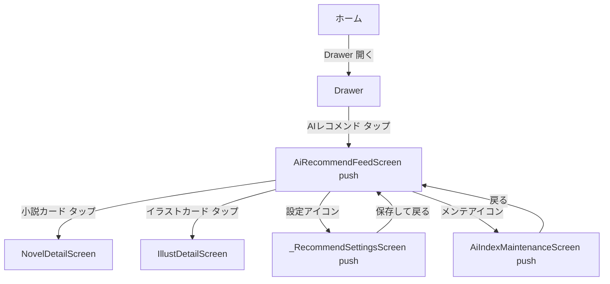
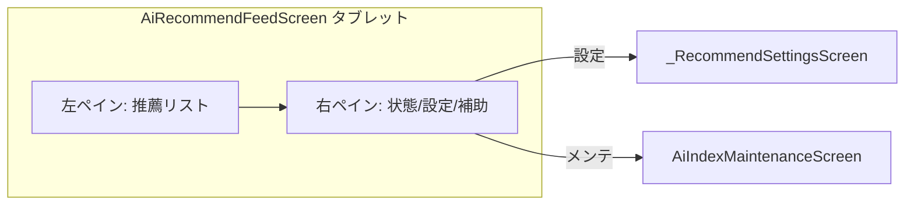

# Phase 1.5 — AIレコメンド 導線・タブレットUI 設計書

> このドキュメントは調査・設計のみを目的とします。**コードは変更しません。**
> 実装は別モード（Code）で、本書の「想定変更ファイル」と「手動テスト項目」に従って行います。

---

## 0. 設計制約（必須要件）

- AIレコメンドは「ボトムナビゲーション」から「波線三本メニュー（Drawer）」へ移動する。
- `home_screen_state.dart` の変更は最小限に留める。
- `selectedIndex` の範囲外クラッシュを絶対に起こさない。
- スマホは1カラムを維持し、タブレット／広幅では2ペインを提案する。
- モデル未導入・履歴不足・候補不足・エラー等の状態でも画面が崩れないこと。

---

## 1. 現状調査

### 1.1 「波線三本」メニューの実体

- 実体は **Drawer**（ハンバーガーメニュー）である。
- 定義箇所: [`home_ui_components.dart`](pixiv_viewer/lib/screens/home_ui_components.dart:95) の `_buildDrawer(BuildContext context)`。
- DrawerHeader は `PixEmber` / `Ultimate State v3.1.0`。
- 既存のリスト項目パターン（2種）:
  1. メインタブ遷移: `Navigator.pop(context); state.changeTab(PixivViewerHomeState.illustIndex);`
  2. 独立画面 push: `Navigator.pop(context); Navigator.push(context, MaterialPageRoute(builder: (_) => const XxxScreen()));`
     - 該当: しおり一覧 / 閲覧履歴 / お気に入りフォルダ / ミュート管理 / 購読タグ / ダウンロードキュー
- **結論**: AIレコメンドは「独立画面 push」パターンの `ListTile` を追加すればよい。

### 1.2 home_screen_state.dart のナビゲーション構造

- インデックス定数（[`home_screen_state.dart`](pixiv_viewer/lib/screens/home_screen_state.dart:155)）:
  - `illustIndex = 0`
  - `novelIndex = 1`
  - `feelingDiscoveryIndex = 2`
  - `recommendIndex = 3`（static const）
- `currentIndex` は `int currentIndex = 0;` で初期化。
- `changeTab(int index, [int? subMode])`（[`home_screen_state.dart`](pixiv_viewer/lib/screens/home_screen_state.dart:407)）:
  - サブモードをリセット、ローディング状態をクリアする。
- `build()` の分岐（[`home_screen_state.dart`](pixiv_viewer/lib/screens/home_screen_state.dart:1680)）:
  ```dart
  currentIndex == feelingDiscoveryIndex
      ? const FeelingDiscoveryScreen()
      : currentIndex == recommendIndex
          ? const AiRecommendFeedScreen()
          : ...
  ```
- ボトムナビゲーション（[`home_screen_state.dart`](pixiv_viewer/lib/screens/home_screen_state.dart:1716)）:
  ```dart
  NavigationBar(
    selectedIndex: currentIndex,
    onDestinationSelected: changeTab,
    destinations: const [
      NavigationDestination(..., label: 'イラスト'),
      NavigationDestination(..., label: '小説'),
      NavigationDestination(..., label: 'フィーリング発掘'),
      NavigationDestination(..., label: 'AIレコメンド'),
    ],
  )
  ```
- **リスク**: `NavigationBar` の `selectedIndex` が destinations の長さ以上になるとクラッシュする。4→3 件に減らす際、`currentIndex == 3`（recommendIndex）にならないよう制御が必要。
- **結論**: ボトムナビから AIレコメンド を削除し、Drawer から push で開く方式にすると、`currentIndex` の選択ロジックに一切触れずに安全に実現できる。`recommendIndex` 定数および `build()` の分岐は「デッドコード」となるため、別モードで削除してもよい（本設計では「削除しても安全」と判断）。

### 1.3 ai_recommend_feed_screen.dart の構造

- 独立した `StatefulWidget`（[`ai_recommend_feed_screen.dart`](pixiv_viewer/lib/screens/ai_recommend_feed_screen.dart:19)）。
- `build()`（[`ai_recommend_feed_screen.dart`](pixiv_viewer/lib/screens/ai_recommend_feed_screen.dart:144)）:
  - `Scaffold` + `AppBar`（title `AIレコメンド` + `Icons.recommend`）。
  - `actions`: 設定（`_navigateToSettings`）、更新（`_loadFeed`）。
  - `body`: `_buildBody(isTablet)`。
- `_buildBody(bool isTablet)`（[`ai_recommend_feed_screen.dart`](pixiv_viewer/lib/screens/ai_recommend_feed_screen.dart:174)）:
  - ローディング状態 / エラー状態（再試行ボタン付き）/ 空状態 / 通常表示。
  - `_result == null || candidates.isEmpty` → `_buildEmptyState()`。
  - 通常表示: `_buildGuidanceBanner` + `Expanded` 内で `RefreshIndicator` → `isTablet ? _buildGrid(result, 2) : _buildList(result)`。
- `isTablet = screenWidth >= 700`（[`ai_recommend_feed_screen.dart`](pixiv_viewer/lib/screens/ai_recommend_feed_screen.dart:146)）。
- `_navigateToDetail(RecommendCandidate)`（[`ai_recommend_feed_screen.dart`](pixiv_viewer/lib/screens/ai_recommend_feed_screen.dart:109)）:
  - `candidate.type == 'novel'` → `NovelDetailScreen(novel: Novel.fromJson(candidate.row))`
  - それ以外 → `IllustDetailScreen(illust: Illust.fromJson(candidate.row))`
- `_navigateToSettings`（[`ai_recommend_feed_screen.dart`](pixiv_viewer/lib/screens/ai_recommend_feed_screen.dart:132)）: `_RecommendSettingsScreen` を push、戻り値で `_service.invalidateCache(); _loadFeed();`。
- `_navigateToMaintenance`（[`ai_recommend_feed_screen.dart`](pixiv_viewer/lib/screens/ai_recommend_feed_screen.dart:125)）: `AiIndexMaintenanceScreen` を push。
- `_buildNovelCard`（[`ai_recommend_feed_screen.dart`](pixiv_viewer/lib/screens/ai_recommend_feed_screen.dart:332)）: 再利用可能な `NovelListCard` を使用。
- `_buildIllustCard`（[`ai_recommend_feed_screen.dart`](pixiv_viewer/lib/screens/ai_recommend_feed_screen.dart:344)）: 独自 `Card`（プレビュー + タイトル/作者/マッチ率）。
- `_RecommendSettingsScreen`（[`ai_recommend_feed_screen.dart`](pixiv_viewer/lib/screens/ai_recommend_feed_screen.dart:412)）: 別 `Scaffold` AppBar `レコメンド設定`。`historyLimit`(30) / `favoriteWeight`(2.0) / `historyWeight`(1.0) の入力。
- **結論**: 画面はすでに自給自足（standalone）であり、Drawer から push するだけで動作する。タブレット向けに `_buildBody` のレイアウトを拡張すればよい。

### 1.4 タブレット判定の既存パターン

- ブレイクポイント定数: [`home_ui_components.dart`](pixiv_viewer/lib/screens/home_ui_components.dart:31) `static const double _kTabletBreakpoint = 700.0;`
- `buildNovelList` では `isTablet = screenWidth >= _kTabletBreakpoint` で `crossAxisCount` を 1(<700) / 2(>=700) に切替。
- イラストグリッドは `>1200=5, >800=4, >500=3, それ以外=2`。
- AIレコメンド画面でも `screenWidth >= 700` でタブレット判定済み。
- 既存の2ペイン実装: なし（全画面1カラムまたはグリッド）。共通レイアウト部品として `NovelListCard` が存在。
- **結論**: ブレイクポイントは **700.0** を統一して採用。デスクトップ/Web も同じ `isTablet` 判定で自動的に広幅レイアウトになる。

### 1.5 作品カードタップ時の遷移

- `_navigateToDetail` で小説/イラストを正しく判定し、それぞれ `NovelDetailScreen` / `IllustDetailScreen` へ独立遷移している（[`ai_recommend_feed_screen.dart`](pixiv_viewer/lib/screens/ai_recommend_feed_screen.dart:109)）。
- **結論**: 遷移ロジックは正しく、タブレット2ペイン化してもそのまま再利用可能。

---

## 2. 変更範囲

| ファイル | 変更内容 | 影響度 |
|----------|----------|--------|
| `home_ui_components.dart` | Drawer に `AIレコメンド` の `ListTile`（Icons.recommend）を追加。`Navigator.pop` + `Navigator.push(const AiRecommendFeedScreen())`。 | 小 |
| `home_screen_state.dart` | `NavigationBar` から `AIレコメンド` の `NavigationDestination` を削除（4→3件）。`recommendIndex` 定数および `build()` の `currentIndex == recommendIndex` 分岐はデッドコード化（削除推奨）。 | 小 |
| `ai_recommend_feed_screen.dart` | `_buildBody` を拡張し、タブレット時は2ペイン（左: 推薦リスト / 右: 状態・設定・補助）を表示。スマホは既存1カラムを維持。 | 中 |

> `main.dart` / `recommendation_service.dart` / `recommendation_math.dart` 等の推薦ロジック本体には変更を加えない。

---

## 3. 画面遷移設計



- ボトムナビからは削除するため、`currentIndex` の選択ロジックは変更しない。
- Drawer からの push は既存の「しおり一覧/履歴」と同一パターンで安全。

---

## 4. スマホUI設計

- 既存の1カラム構成を維持。
- `isTablet == false` の場合は現在の `_buildList` / `_buildGrid(result, 2)` をそのまま使用。
- AppBar（設定・更新）と `_buildGuidanceBanner`（マッチ率説明）の配置は変更なし。
- 変更なしを原則とし、`home_screen_state.dart` のボトムナビ削除のみが影響範囲。

---

## 5. タブレットUI設計

### 5.1 採用案: 2ペイン（左リスト / 右ステータス＋設定）

- ブレイクポイント: `screenWidth >= 700.0`（既存 `_kTabletBreakpoint` と統一）。
- レイアウト: `Row` で左右分割。
  - **左ペイン（推薦リスト）**: 既存 `_buildList` / `_buildGrid` を再利用。`NovelListCard` および `_buildIllustCard` をそのまま使用。グリッド列数は広幅に合わせ `crossAxisCount` を 2→3 程度へ拡張してもよい。
  - **右ペイン（幅約320px固定）**: 以下を縦に配置。
    1. モデル状態サマリー（`RecommendationService.isModelReady()` / `embeddingCoverageRatio()`）。
    2. 現在の設定サマリー（`RecommendSettings` の `historyLimit` / `favoriteWeight` / `historyWeight`）。
    3. 「レコメンド設定」ボタン（`_navigateToSettings` を呼ぶ）。
    4. 「インデックス管理」ボタン（`_navigateToMaintenance` を呼ぶ）。
    5. フィルタ/統計の拡張用プレースホルダ（将来拡張）。
- 右ペインのボタン押下時は、スマホ同様に `push` で画面遷移（または今後ダイアログ化）。

### 5.2 代替案との比較

| 案 | 実装コスト | 既存再利用 | スマホ影響 | 拡張性（フィルタ/統計） |
|----|-----------|-----------|-----------|------------------------|
| **A. 一覧 + 右固定サイドカード（採用）** | 低（Row分割のみ） | 高（_buildList/_buildGrid/NovelListCard 再利用） | なし | 高（右ペインに追記可能） |
| B. 一覧 + 右上設定パネル（開閉） | 中（Expansion/Dialog） | 中 | 小（AppBar拡張） | 中（パネル内のみ） |
| C. 一覧 + 固定サイドカード（ステータスのみ） | 低 | 高 | なし | 低（表示のみ） |

- **優先方針順（実装コスト < 既存再利用 < スマホ影響 < 拡張性）**に従い、**案A** を採用。
- 案Bは設定パネルの開閉状態管理が増えるため、まずは案Aで十分。案Cは将来のフィルタ/統計拡張に弱いため不採用。

### 5.3 採用案の構成図



---

## 6. 状態別UI

| 状態 | スマホ | タブレット（右ペイン） |
|------|--------|------------------------|
| モデル未導入 | `_buildGuidanceBanner` で「モデル未取得」案内 + 一覧はAPIフォールバック | 右ペインに「モデル: 未取得」バッジ + 取得導線ボタン |
| 初期化失敗 | エラー状態（再試行ボタン） | 右ペインにエラー表示 + 再試行 |
| 履歴不足 | `_buildEmptyState` またはバナー案内 | 右ペインに「履歴が不足しています」案内 |
| 候補不足 | `_buildEmptyState`（「条件に合う作品が見つかりません」） | 右ペインに同メッセージ |
| ローディング | `CircularProgressIndicator` 中央 | 左リスト領域にインジケータ、右ペインは省略または保留 |
| エラー | エラーカード + `再試行` | 右ペインにエラー + 再試行 |

- どの状態でも `NavigationBar` の選択ロジックや `selectedIndex` には依存しない（Drawer push のため安全）。
- レイアウトが崩れないよう、右ペインは `SingleChildScrollView` で包む。

---

## 7. 想定変更ファイル

1. [`home_ui_components.dart`](pixiv_viewer/lib/screens/home_ui_components.dart:95) — Drawer に `AIレコメンド` `ListTile` を追加。
2. [`home_screen_state.dart`](pixiv_viewer/lib/screens/home_screen_state.dart:1716) — `NavigationBar` から `AIレコメンド` を削除。`recommendIndex` 定数と `build()` のデッド分岐を削除（別モードで実施）。
3. [`ai_recommend_feed_screen.dart`](pixiv_viewer/lib/screens/ai_recommend_feed_screen.dart:174) — `_buildBody` にタブレット2ペイン分岐を追加。

> 新規ファイルは作成しない。既存ウィジェット（`NovelListCard` 等）を最大化再利用する。

---

## 8. 手動テスト項目

- [ ] ボトムナビに「AIレコメンド」が表示されないこと。
- [ ] Drawer の「AIレコメンド」をタップすると `AiRecommendFeedScreen` が開くこと。
- [ ] Drawer から開いた後、戻る（pop）でホームに戻り、`currentIndex` が維持されていること。
- [ ] 小説カードタップ → `NovelDetailScreen` へ遷移すること。
- [ ] イラストカードタップ → `IllustDetailScreen` へ遷移すること。
- [ ] 設定アイコン → `_RecommendSettingsScreen` が開き、保存後にフィードが再読込されること。
- [ ] メンテアイコン → `AiIndexMaintenanceScreen` が開くこと。
- [ ] スマホ幅（<700）では1カラム、タブレット幅（>=700）では2ペインが表示されること。
- [ ] モデル未導入 / 履歴不足 / 候補不足 / エラー の各状態で画面が崩れないこと（右ペイン含む）。
- [ ] `flutter analyze` で新規エラーが発生しないこと。

---

## 9. 実装ブロッカー

- **なし**。本設計は既存コードの調査のみで完了しており、実装にあたり追加の調査や外部依存の解決は不要。
- 注意点: `recommendIndex` 定数と `build()` 分岐の削除は「デッドコード化」の確認のみ。別モード実装時に `currentIndex` が 3 にならないことを `flutter analyze` / 手動テストで確認すれば安全。
