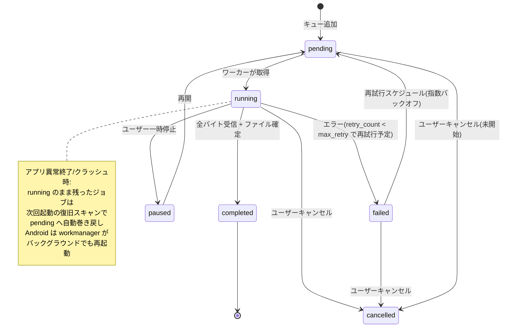

# Phase 2「オフライン閲覧とダウンロードキュー」設計書

> 調査ベース: 現行 HEAD（DB バージョン 16）を直接読取。Phase 1 完了報告は仮定せず、現行コードを優先。
> コード変更なし。本ファイルのみ更新。
> ステータス: **実装ブロッカー 0 件（承認後に code モードで実装可能）**。
> バージョン補足: workmanager は最新安定版 **0.9.0+3（0.9.x 系）** を採用（初版案の `^0.5.2` は 2 世代古いため修正）。

---

## 0. 現状調査サマリ（事実ベース）

### 0.1 依存パッケージ（pubspec.yaml より抜粋）
- HTTP: `http ^1.1.0`
- ストレージ: `sqflite ^2.3.0`, `path ^1.8.3`, `path_provider ^2.1.1`
- 権限: `permission_handler ^11.3.1`
- ZIP展開: `archive ^3.3.7`
- ギャラリー保存: `image_gallery_saver_plus ^5.1.1`
- 暗号化(ハッシュ): `crypto ^3.0.3`
- **workmanager: 未導入 → Phase 2 で `workmanager: ^0.9.0` を追加導入（解決版 = 0.9.0+3。federated 化済みの 0.9.x 系）。Android のみバックグラウンド起動に使用し、他OSでは `Workmanager().initialize()` を呼ばない（初期化ガード）。**
- **gif パッケージ: 未導入 → Phase 2 では導入せず、うごイラは ZIP 保存のみ（GIF/APNG/動画変換は除外。将来対応用メタデータを DB に保持）**

### 0.2 DB バージョン
- [`database_service.dart:29`](pixiv_viewer/lib/services/database_service.dart:29) → `version: 16`
- 次のマイグレーションは **17** とする。

### 0.3 既存ダウンロード実装（download_service.dart）
- シングルトン `DownloadService()`。
- **インメモリキュー**（`List<DownloadItem> _downloadQueue`）。アプリ再起動で消失。
- `processQueue(onProgress, onSuccess, onError)` は **1件ずつ同期順処理**（`_isProcessing` ガード）。同時並行性なし。
- 保存先:
  - Android: `getExternalStorageDirectory()` の親の `Download/`
  - iOS: `getApplicationDocumentsDirectory()/Downloads`
  - Desktop: `getDownloadsDirectory()`
- 画像は `http.get(url, headers: PixivHttpHeaders.image)` で取得 → ファイル書込 → `_saveToGallery`（ギャラリーにも複写）。
- うごイラ: `getUgoiraMetadata` → ZIP 取得 → GIF または ZIP 保存。**GIF変換は未実装**（Phase 2 は ZIP のみ）。
- DB への永続化は `DatabaseService().insertDownloadedIllust(...)`（`downloaded_illust` へ `illust_id, local_path, thumbnail_path, download_date`）。
- Isolate は **使用禁止**（UI コールバック捕捉で `object is unsendable` クラッシュ済みの実績あり、コメント参照）。

### 0.4 小説本文キャッシュ（既存オフライン本棚）
- テーブル `novel_text`: `work_id PK, pages_json, text, updated_at, title, author_name`
- 更新タイミング:
  - [`novel_detail_screen.dart:83`](pixiv_viewer/lib/screens/novel_detail_screen.dart:83): 詳細画面で `api.getNovelText` → `saveNovelText`
  - [`novel_reader_data.dart:378`](pixiv_viewer/lib/screens/novel_reader_data.dart:378): リーダーで取得後 `saveNovelText`
  - [`novel_reader_data.dart:415`](pixiv_viewer/lib/screens/novel_reader_data.dart:415): `_loadNovelTextFromDb` が DB 優先で読込
- 一覧: `OfflineBookshelfScreen`（`getCachedNovelTexts` / `getCachedNovelTextsTotalBytes`）

### 0.5 HTTP / 認証（pixiv_api_http.dart, pixiv_api_service.dart）
- 共有クライアント: `PixivHttpClient().client`（シングルトン、`http.Client`）
- 共通ヘッダー `clientHeaders`: `User-Agent`, `App-OS`, `App-OS-Version`, `App-Version`, `Accept-Language`, `Accept-Encoding`
- 認証: `Authorization: Bearer <token>`（`getAccessToken(getRefreshToken())`）
- 画像CDNヘッダー `PixivHttpHeaders.image`: `{Referer: https://www.pixiv.net/, User-Agent}`（**Referer 必須、認証不要**）
- エラー挙動（自動再試行なし）:
  - `429` → `RateLimitException` / `PixivRateLimitException` を throw
  - `401` → `AuthException` を throw（再ログイン誘導）
  - その他 → `Exception('Pixiv APIエラー: ...')`
- トークンリフレッシュは `getAccessToken` 内で毎回実施。401 時の再リフレッシュ＋1回再試行は **未実装** → Phase 2 で `getAccessToken(refreshToken, force: true)` を追加し、`DownloadService` 内リトライラッパーから利用。
- キャンセル: `http.Client` の `CancelToken` 相当は未使用 → Phase 2 は `http.Request` + `StreamedResponse` + `subscription.cancel()` で中断。

### 0.6 バックアップ（database_search.dart）
- `exportAllData()` / `importAllData()` は **DB テーブルのみ**（JSON 行）。バイナリファイルは含まれない。
- 対象テーブル: `novels, novel_text, novel_embeddings, illusts, illust_embeddings, history, downloaded_illust, mutes, folders, folder_items, subscribed_tags, read_later, search_history`
- Google Drive バックアップ（`google_drive_service.dart`）はこの JSON をアップロード。
- `downloaded_illust` はメタデータのみ対象。実ファイルはバックアップ対象外。
- **Phase 2 追加**: `download_queues` テーブルをエクスポート/インポート対象に追加（メタデータ JSON）。実バイナリは除外。

### 0.7 ナビゲーション
- 下部 `NavigationBar`（[`home_screen_state.dart:1719`](pixiv_viewer/lib/screens/home_screen_state.dart:1719)）: イラスト / 小説 / フィーリング発掘 / AIレコメンド の **4タブ**（Phase 1 で追加済）。
- `Drawer` に `OfflineBookshelfScreen`（小説キャッシュ一覧）が既存。
- Web 対応: `kIsWeb` の分岐は現状なし。`path_provider` のディレクトリ API は Web で `UnsupportedError` → Phase 2 は各保存前に `kIsWeb` ガードで縮退。

### 0.8 画像表示ウィジェット（pixiv_image.dart）
- `PixivImage` は `Image.network(url, headers: PixivHttpHeaders.image)` のみ。**ローカルファイル優先表示の仕組みなし**。
- オフライン対応には `localFile` 引数の追加が必要（後方互換: `null` なら従来動作）。

### 0.9 Android マニフェスト / Gradle 実態（workmanager 判断根拠）
- [`android/app/src/main/AndroidManifest.xml`](pixiv_viewer/android/app/src/main/AndroidManifest.xml):
  - 権限: `INTERNET`, `ACCESS_NETWORK_STATE`, `READ_MEDIA_IMAGES`, `READ_MEDIA_VIDEO`, `WRITE_EXTERNAL_STORAGE(maxSdk=32)` のみ
  - **`FOREGROUND_SERVICE` 権限: なし**
  - **`FOREGROUND_SERVICE_DATA_SYNC` 権限: なし**
  - **service への `android:foregroundServiceType` 宣言: なし**
- [`android/app/build.gradle.kts`](pixiv_viewer/android/app/build.gradle.kts):
  - `compileSdk = flutter.compileSdkVersion`, `minSdk = flutter.minSdkVersion`, `targetSdk = flutter.targetSdkVersion`（Flutter テンプレート既定。targetSdk が API 34(Android 14) 以上の場合、FGS type 要件が発動）

---

## 1. 対応OSマトリクス

| OS | 永続バイナリ保存 | バックグラウンド実行 | 保存先ディレクトリ | 制限事項 |
|----|----------------|---------------------|-------------------|---------|
| Android | ○ (`getExternalStorageDirectory`/app-doc) | ○ **workmanager 0.9.x 導入**（アプリ終了後もキュー継続） | `getExternalStorageDirectory()/Download`（既存流用）または app-doc `Downloads/` | Android 14+ は `FOREGROUND_SERVICE` + `FOREGROUND_SERVICE_DATA_SYNC` + `foregroundServiceType=dataSync` が必要（後述 11.3） |
| iOS | ○ (`getApplicationDocumentsDirectory`) | △ フォアグラウンドのみ（`workmanager_apple` は存在するが Phase 2 は採用せず） | `Documents/Downloads/` | バックグラウンド fetch 制限厳格。フォアグラウンド実行に留める |
| Windows | ○ (`getDownloadsDirectory`) | △ フォアグラウンドのみ | `getDownloadsDirectory()` | バックグラウンド機構なし |
| macOS | ○ (`getDownloadsDirectory`) | △ フォアグラウンドのみ | `getDownloadsDirectory()` | 同上 |
| Linux | ○ (`getDownloadsDirectory`) | △ フォアグラウンドのみ（`workmanager_linux` は experimental で除外） | `getDownloadsDirectory()` | 同上 |
| Web | × 不可 | × 不可（`workmanager_web` は experimental で除外） | なし（IndexedDB も未使用） | `path_provider` のディレクトリ API は `UnsupportedError`。**縮退設計必須**（UI のみ、実ダウンロード不可・キュー管理もメモリのみで永続化しない） |

**結論**: バックグラウンド継続ダウンロードは **Android のみ workmanager 0.9.x で対応**（アプリがバックグラウンド/終了しても `WorkManager` がキューを再起動）。iOS/Windows/Linux/macOS/Web はアプリがフォアグラウンドにある間に `DownloadService` 内の非同期ループで処理（縮退）。workmanager 0.9.x は federated 化されており、初期化は `Platform.isAndroid` ガードで Android のみ実行し、他OSでは `Workmanager()` を初期化・登録しない（パッケージは導入するが no-op）。これにより Android 14+ の Foreground Service 要件は workmanager の `setForegroundAsync` + マニフェスト権限で満たす。

---

## 2. DB スキーマ案（version 17）

### 2.1 新規テーブル `download_queues`

```sql
CREATE TABLE download_queues (
  id INTEGER PRIMARY KEY AUTOINCREMENT,
  parent_id INTEGER,
  work_id INTEGER NOT NULL,
  work_type TEXT NOT NULL,
  page_index INTEGER NOT NULL DEFAULT 0,
  page_total INTEGER NOT NULL DEFAULT 1,
  url TEXT NOT NULL DEFAULT '',
  local_path TEXT NOT NULL DEFAULT '',
  file_size INTEGER NOT NULL DEFAULT 0,
  downloaded_bytes INTEGER NOT NULL DEFAULT 0,
  status TEXT NOT NULL DEFAULT 'pending',
  retry_count INTEGER NOT NULL DEFAULT 0,
  max_retry INTEGER NOT NULL DEFAULT 3,
  error_code TEXT,
  error_message TEXT,
  priority INTEGER NOT NULL DEFAULT 5,
  created_at TEXT NOT NULL,
  updated_at TEXT NOT NULL,
  completed_at TEXT,
  FOREIGN KEY (parent_id) REFERENCES download_queues(id) ON DELETE CASCADE
);
CREATE INDEX idx_dq_status ON download_queues(status);
CREATE INDEX idx_dq_work ON download_queues(work_id, work_type);
CREATE INDEX idx_dq_parent ON download_queues(parent_id);
```

### 2.2 `downloaded_illust` の変更差分
現行（`illust_id PK, local_path, thumbnail_path, download_date`）は **維持**しつつ、新設 `download_queues` が正源とする。後方互換のため `insertDownloadedIllust` は親ジョブ `completed` 時に `download_queues.local_path` をコピーして呼ぶ（既存ギャラリー一覧互換）。追加カラムは不要。

### 2.3 親子関係
- 複数ページ作品（漫画・うごイラ）は `parent_id = NULL` の「親ジョブ」1件 ＋ `page_index=0..N-1` の「子ジョブ」N件。
- 単品イラストは親ジョブのみ（`page_total=1`, `page_index=0`）。
- 親が `completed` になるのは **全子ジョブが `completed` の時のみ**。
- 小説は本文1件（`work_type='novel'`, `page_index=0`）。付随データは別途 `novels`/`novel_text` に既存手段で保存し、キューには含めない。
- うごイラは `work_type='ugoira'` で1ジョブ（`page_index=0`、`url` = ZIP URL）。ZIP 保存のみ。`work_type` と `url` をそのまま DB に保持（将来GIF変換用）。

### 2.4 マイグレーション（version 16 → 17）
[`database_service.dart`](pixiv_viewer/lib/services/database_service.dart:723) の `_onUpgrade` に `if (oldVersion < 17)` を追加: `CREATE TABLE download_queues (...)` と3インデックス。`onOpen` 側の `_ensureTablesExist` にも `CREATE TABLE IF NOT EXISTS download_queues` を追加し冪等性を保つ。

---

## 3. 状態遷移図



**異常終了復旧**: アプリ起動時（または `DownloadService.init()`）に `status='running'` の全ジョブを `status='pending'`, `downloaded_bytes` 維持, `error_code='recovered'` として巻き戻す。部分ダウンロード済みファイルは一時ファイルとして残し、再開時に Range リクエストで継続。

---

## 4. DownloadService 設計

既存 `DownloadService` を拡張（破壊的変更は最小化）。

### 4.1 責務分割
- **キュー管理**: DB（`download_queues`）が正源。メモリには稼働中スナップショットのみ保持。
- **優先度制御**: `priority` 昇順、`created_at` 昇順で `pending` を選出。
- **同時ダウンロード数**: 定数 `maxConcurrent = 3`（Web は 1）。`running` 数をカウントし上限で `pending` 取得を停止。
- **非同期手法**: Isolate **不使用**。Future + async/await のイベントループで並行。
- **キャンセル伝播**: `http.Request` + `StreamedResponse` を使用し、`cancelled` 時に `response.stream.cancel()` を呼ぶ。`bool _cancelled` フラグ + `StreamSubscription` キャンセル。
- **認証ヘッダー取得タイミング**: 画像CDNは `PixivHttpHeaders.image`（認証不要）。小説本文APIは `Bearer` 付与。401 再試行時は `getAccessToken(refreshToken, force: true)` で強制リフレッシュ。
- **アプリ復帰時のジョブ復旧**: `init()` で (a) `running→pending` 巻き戻し、(b) `paused` はそのまま保留、(c) `pending` を自動再開（設定でオフ可）。
- **Android バックグラウンド起動**: workmanager 0.9.x の `Workmanager().executeTask` コールバック（pigeon ベース）から `DownloadService().runBackgroundOnce(inputData)` を呼び、DB の `pending` を処理。長時間タスクは `setForegroundAsync` で通知付き実行（11.3）。

### 4.2 UI 連携
- 進捗は `ValueNotifier<Map<int, DownloadProgress>>` またはストリームで公開（既存 `onProgress` コールバックは維持しつつ拡張）。
- 長時間処理パターンは既存の `CircularProgressIndicator` / `LinearProgressIndicator` を踏襲。

---

## 5. HTTP・リトライ方針

| ステータス | 挙動 | error_code |
|-----------|------|----------|
| 200 | 成功 | — |
| 401 | トークン再リフレッシュ → **1回だけ**再試行。失敗なら `failed` | `401` |
| 403 | 再試行しない（権限なし）。`failed` 固定 | `403` |
| 404 | 再試行しない（存在しない）。`failed` 固定 | `404` |
| 429 | 指数バックオフ（ベース 2s × 2^retry）後再試行。`max_retry` 到達で `failed` | `429` |
| ネットワーク断 / タイムアウト | 指数バックオフ（初期 1s, 上限 30s）、最大 `max_retry` 回 | `network` |
| その他 5xx | 429 と同様のバックオフ再試行 | `server` |

- **Range ヘッダー再開**: `downloaded_bytes > 0` かつ `Accept-Ranges: bytes` 対応の場合、`Range: bytes=<downloaded_bytes>-` を付与し追記モードで書込。非対応なら最初から再ダウンロード（一時ファイルを破棄）。
- `getAccessToken(await getRefreshToken(), force: true)` を `PixivHttpClient` に追加（401 再試行用）。

---

## 6. ファイル管理

- **一時ファイル命名**: `<local_dir>/.<work_id>_<page_index>.part`。完了時に `atomic rename` で正式名へ。
- **atomic rename の OS 差**: 同一ボリューム内 `File.rename` は POSIX/Windows ともにアトミック。クロスボリューム時は `copy` + `delete` フォールバック。一時ファイルと最終パスは同一ディレクトリに置き `rename` を保証。
- **ファイルと DB の整合性**: 1.一時ファイルへ書込 2.`downloaded_bytes` 随時更新 3.完了→`File.rename`で確定→`status='completed'`,`local_path=確定パス`,`completed_at=now` 4.失敗時は一時ファイルを残し/取消時削除。
- **外部削除検出と修復**: `OfflineBookshelfScreen` 等で `File(local_path).existsSync()` を確認。存在しなければ `failed`/`missing` にし再ダウンロード提示。`DownloadService.verifyIntegrity()` で提供。

---

## 7. オフライン表示対応

### 7.1 イラスト詳細（ローカル優先）
- [`illust_detail_screen.dart`](pixiv_viewer/lib/screens/illust_detail_screen.dart) / [`illust_detail_ui_components.dart`](pixiv_viewer/lib/screens/illust_detail_ui_components.dart) で `download_queues`/`downloaded_illust` から `local_path` を解決し、存在すれば `Image.file(File(local_path))` を優先、なければ `PixivImage(url)` をフォールバック。
- `PixivImage` に `File? localFile` 引数を追加（後方互換: `localFile == null` なら従来動作）。
- **スコープ**: イラスト詳細画面のみ（ホーム一覧/グリッドへの波及は Phase 2 外）。

### 7.2 小説リーダー（DB キャッシュ優先：既に実装済）
- [`novel_reader_data.dart:415`](pixiv_viewer/lib/screens/novel_reader_data.dart:415) の `_loadNovelTextFromDb` が DB 優先。`work_type='novel'` ジョブ完了で `saveNovelText` を確実に呼ぶよう `DownloadService` からトリガー。

### 7.3 うごイラ・付随データの保存方針
- **うごイラ ZIP**: `work_type='ugoira'` として1ジョブ（`page_index=0`、`url`=ZIP URL）。**Phase 2 は ZIP 保存のみ**。GIF/APNG/動画変換は **除外（将来拡張）**。`work_type`・`url`・`local_path(ZIP)` を DB に保持。
- **作者アイコン**: オフライン表示でのみ必要だが、`author` 情報は `novels`/`illusts` の `meta_json` に含まれる既存キャッシュを活用。専用ダウンロードは **Phase 2 外**。
- **タグ / シリーズ情報**: `novels.meta_json` / `illusts.meta_json` に保存済み。キューには含めない。

---

## 8. バックアップ方針

- **バックアップ「しない」情報（再ダウンロード可能なバイナリ）**: 実画像ファイル、うごイラ ZIP → Google Drive バックアップ容量節約のため **除外**。復元後はキューから `pending` で再ダウンロード可能。
- **バックアップ「する」情報（メタデータ）**: `download_queues` テーブル全体（ジョブ状態・URL・進捗・優先度）。既存 `exportAllData`/`importAllData` の対象テーブルに `download_queues` を追加（[`database_search.dart:324`](pixiv_viewer/lib/services/database_search.dart:324) の export と [`database_search.dart:305`](pixiv_viewer/lib/services/database_search.dart:305) の import に追記）。`downloaded_illust` は既存通りメタデータのみ。
- **復元時の動作**: `importAllData` で `download_queues` を復元。`local_path` は実ファイルがないため、復元後に `status` を `pending` へ一括リセット（`recovered_from_backup` マーカー）し、ユーザーが再ダウンロードできるよう仕向ける。

---

## 9. テスト計画

### 9.1 DB キュー状態遷移の単体テスト（download_queue_test.dart）
- `pending→running→completed` の正常遷移
- `pending→running→failed→pending`（再試行）の遷移と `retry_count` 増加
- `running→paused→pending` の再開
- `running→cancelled` / `failed→cancelled` / `pending→cancelled`
- 親子: 全子 `completed` で親が `completed` になること
- 親 `cancelled` で子も `cancelled` になること

### 9.2 異常終了後の復旧テスト
- `running` 状態で `recover()` を呼ぶと `pending` に戻ること
- `downloaded_bytes` が維持されること

### 9.3 部分成功テスト（複数ページの一部失敗）
- 5ページ中 2ページ `failed`、3ページ `completed` → 親は `failed`（または `pending` 再試行待ち）
- 失敗ページのみ再試行で `completed` → 親が `completed` になること

### 9.4 HTTP エラーコードテスト（http の MockClient 使用）
- 401: 再リフレッシュ後1回再試行 → 成功
- 403 / 404: 再試行せず `failed`（`error_code` 確認）
- 429: バックオフ待機後に再試行
- ネットワーク断: 指数バックオフ、最大 `max_retry` で `failed`

### 9.5 ファイルと DB 不整合の修復テスト
- `local_path` のファイルが存在しない場合、`verifyIntegrity()` が `missing` 検出
- 再ダウンロードで `completed` 復帰

### 9.6 OS 別ディレクトリ取得テスト
- `path_provider` の各 `getXxxDirectory` が null を返す環境での例外安全性
- Web（`kIsWeb`）での縮退動作（後述 9.7）

### 9.7 Web の縮退動作テスト
- `DownloadService` が Web で `unsupported` 状態になり、UI に「この環境ではダウンロードできません」を表示
- キュー追加時に即 `cancelled` または無視
- `flutter analyze` / `flutter test` が Web ビルドでもコンパイルエラーなし

### 9.8 workmanager（Android）結合テスト
- `Workmanager().executeTask` コールバック（0.9.x pigeon）から `runBackgroundOnce(inputData)` を呼び、DB の `pending` が処理されること
- 長時間タスクで `setForegroundAsync` が通知を表示すること（Android 14+ で `FOREGROUND_SERVICE_DATA_SYNC` 権限下でクラッシュしないこと）

---

## 10. 受け入れ条件

- [ ] `pending/running/paused/completed/failed/cancelled` が正しく遷移する（単体テストで検証）
- [ ] アプリ異常終了後も `running` ジョブが `pending` に復旧される
- [ ] 同時ダウンロード数が `maxConcurrent`（既定3）を超えない
- [ ] 複数ページ作品が全ページ成功するまで `completed` にならない
- [ ] Android では workmanager 0.9.x によりバックグラウンド/アプリ終了後もキューが継続処理される
- [ ] Web で縮退設計がコンパイルエラーなく動作する
- [ ] `flutter analyze` で今回由来のエラーが 0 件
- [ ] `flutter test` が全成功

---

## 11. 決定事項サマリ（ブロッカー解決）

### 11.1 実装ブロッカー状態
**ブロッカー: 0 件**。全 11 項目を解決（解決ログは 12 章）。承認後に code モードで実装可能。

### 11.2 workmanager の最終決定と根拠（0.9.x 系）
**決定**: **Android のみ workmanager 0.9.x を導入してバックグラウンド継続ダウンロードに対応。iOS/Windows/Linux/macOS/Web はフォアグラウンドワーカーのみ（縮退）。Web/Linux の experimental パッケージは採用せず除外。**

**採用バージョン**: `workmanager: ^0.9.0`（解決版 = **0.9.0+3**、最新安定版）。初版案の `^0.5.2` は 2 世代古いため修正。
- **Dart SDK 互換性**: 0.9.x 系は `sdk: '>=3.3.0 <4.0.0'`（Flutter >= 3.22 相当）を要求し、本プロジェクトの `sdk: ^3.12.0` を満たす。最終的な解決バージョンは実装時 `flutter pub add workmanager` でロックファイルに固定。

**根拠（具体的事実）**:
1. `pubspec.yaml` に `workmanager` は **未導入** → Phase 2 で `workmanager: ^0.9.0` を追加。federated 化済みのため、meta パッケージ導入で `workmanager_platform_interface` / `workmanager_android` / `workmanager_apple` が透過的に解決される（別途手動追加は不要）。
2. [`android/app/src/main/AndroidManifest.xml`](pixiv_viewer/android/app/src/main/AndroidManifest.xml): `FOREGROUND_SERVICE` 権限・`FOREGROUND_SERVICE_DATA_SYNC` 権限・service の `foregroundServiceType` いずれも **未宣言** → 導入時にマニフェスト追記が必要（11.3 で具体化）。
3. [`android/app/build.gradle.kts`](pixiv_viewer/android/app/build.gradle.kts): `targetSdk = flutter.targetSdkVersion`（Flutter 既定は API 34 以上の傾向）→ **Android 14(API 34) の FGS type 要件が発動**する環境を前提とする。
4. 0.9.x の技術的ブロッカーは **なし**: パッケージは実在・保守中。Android 初期化クラッシュ(#645)・周期タスク頻度バグ(#622) は 0.9.x で修正済み。iOS の BGTask は別フェーズとし、Android 優先で導入。

**0.9.x の破壊的変更への対応（詳細は 11.6）**: federated 化、pigeon 内部化、`inputData` が JSON 文字列からネイティブ `Map` 転送へ変更、`OutOfQuotaPolicy` 命名変更（`run_as_non_expedited_work_request` → `runAsNonExpeditedWorkRequest`）。

**代替案（採用せず）**: フォアグラウンドのみ（workmanager 非導入）→ ユーザー指示により却下。Web/Linux experimental 採用 → 不安定なため却下（11.4）。

### 11.3 Android 14+ Foreground Service（TYPE_DATA_SYNC）対応方針
workmanager 0.9.x でも長時間ダウンロードをバックグラウンド実行する際、Android 14(API 34) 以降は以下が必須（0.9.x でも要件は変わらず継続）:
1. **権限追加**（`AndroidManifest.xml`）: `FOREGROUND_SERVICE` と `FOREGROUND_SERVICE_DATA_SYNC`。
2. **service の type 宣言**: workmanager プラグイン（0.9.x は `workmanager_android`）が宣言する DispatcherService に対し、アプリ側 `AndroidManifest.xml` で `tools:replace` を用いて `android:foregroundServiceType="dataSync"` を付与（プラグイン既定では type 未宣言のため、Android 14 で `SecurityException` を防ぐ）。対象 service 名は実装時に `workmanager_android` の AndroidManifest で確認。
3. **フォアグラウンド実行**: `WorkManager` の `setForegroundAsync(ForegroundInfo(...))` で通知付き実行。通知チャネル `pixiv_viewer_download` を作成。
4. **互換性**: Android < 14 は `FOREGROUND_SERVICE` 権限のみで動作。`FOREGROUND_SERVICE_DATA_SYNC` は 14+ のみ参照される安全な権限。
5. **iOS**: `workmanager_apple` は存在するが Phase 2 では初期化せず（BGTaskScheduler 連携は複雑なため別フェーズ）、iOS はフォアグラウンドのみ。

### 11.4 除外項目一覧（Phase 2 スコープ外）
| 項目 | 理由 | 将来対応 |
|------|------|----------|
| うごイラ GIF/APNG/動画変換 | 既存 `_convertToGif` 未実装、`gif` パッケージ未導入。ZIP 保存で十分なオフライン閲覧が可能 | `gif` パッケージ導入 + `work_type='ugoira'` の `local_path(ZIP)` から変換ロジック追加 |
| 作者アイコン・関連サムネイルのオフライン化 | `novels`/`illusts` の `meta_json` 既存キャッシュで表示可能。専用DLは冗長 | 別フェーズでアイコンDL追加 |
| ストレージ残量の自動ガード（自動停止） | 実装ブロッカーではないがスコープ外。手動確認UIのみ | `dart:io` / プラットフォーム API で残量取得→自動停止 |
| **Web での workmanager 利用（experimental）** | `workmanager_web` は experimental で制限多数（確実なバックグラウンド起動保証なし）。不安定なため Phase 2 は採用せずフォアグラウンド縮退のみ | 安定化後に別フェーズで評価 |
| **Linux での workmanager 利用（experimental）** | `workmanager_linux` は experimental で制限多数。同上 | 同上 |
| workmanager の iOS バックグラウンド | `workmanager_apple` は存在するが BGTaskScheduler 連携が複雑。Android 優先 | 別フェーズ |
| `downloaded_illust` と `download_queues` の統合 | 既存ギャラリー互換のため両方維持。統合は別フェーズ | 将来的な単一正源化 |

### 11.5 変更前後の差分サマリ（design doc v1→v2→v3）
| 項目 | v1（11ブロッカー） | v2（0ブロッカー） | v3（本版・0ブロッカー） |
|------|---------------------------|---------------------------|---------------------------|
| workmanager バージョン | 未指定 | `^0.5.2`（2世代古い） | **`^0.9.0`（0.9.0+3、最新安定）** |
| バックグラウンド実行 | workmanager 非採用（フォアグラウンドのみ） | Android は workmanager 採用 / 他OS フォアグラウンドのみ | **Android は workmanager 0.9.x 採用 / 他OS フォアグラウンドのみ** |
| Web/Linux experimental | — | 言及なし | **experimental 採用せず除外（11.4）** |
| うごイラ | GIF 未実装で「実装ブロッカー」扱い | ZIP 保存のみ（メタデータ保持）、GIF 変換は除外項目へ | 同左（維持） |
| ストレージ残量 | 実装ブロッカー扱い | 実装ブロッカーではない → 除外項目 | 同左（維持） |
| 認証ヘッダー force | 影響レビュー要（ブロッカー） | `getAccessToken(force:)` 追加を明示方針に | 同左（維持） |
| 小説オフライン範囲 | 作者アイコン要否を確認要（ブロッカー） | `novel_text` 本文優先で十分、アイコンは除外項目に | 同左（維持） |
| downloaded_illust | 二重管理リスクを確認要（ブロッカー） | 互換維持＋将来統合を除外項目に | 同左（維持） |
| DB v17 競合 | 再確認要（ブロッカー） | HEAD=16 を確認済み、v17 で衝突なし | 同左（維持） |
| DownloadService 破壊的変更 | 影響レビュー要（ブロッカー） | シグネチャ維持＋拡張を明示方針に | 同左（維持） |
| Image.file 切替タイミング | 一覧波及を確認要（ブロッカー） | イラスト詳細のみに限定（一覧は除外） | 同左（維持） |
| Web path_provider | 挙動差確認要（ブロッカー） | `kIsWeb` ガードで縮退を明示方針に | 同左（維持） |
| http.Client 並行制限 | 実機検証要（ブロッカー） | `maxConcurrent=3` で上限制御を明示方針に | 同左（維持） |
| **合計ブロッカー** | **11 件** | **0 件** | **0 件** |

### 11.6 workmanager 0.9.x API 例とセットアップ手順

**pubspec.yaml（最終依存指定）**:
```yaml
dependencies:
  flutter:
    sdk: flutter
  # ...既存...
  workmanager: ^0.9.0   # 解決: 0.9.0+3（最新安定）。federated 化済み
```
- 別途 `workmanager_platform_interface` / `workmanager_android` / `workmanager_apple` の手動追加は不要（meta パッケージが透過的に解決）。
- Web/Linux 用 experimental（`workmanager_web` / `workmanager_linux`）は **追加しない**。

**Dart 初期化（0.9.x pigeon ベース）**:
```dart
@pragma('vm:entry-point')
void callbackDispatcher() {
  Workmanager().executeTask((task, inputData) async {
    // inputData は 0.9.x ではネイティブ Map<String, dynamic>?（JSON 文字列ではない）
    await DownloadService().runBackgroundOnce(inputData);
    return Future.value(true);
  });
}

void main() {
  WidgetsFlutterBinding.ensureInitialized();
  // 0.9.x: Android のみ初期化・登録。他OSは初期化しない（no-op）
  if (Platform.isAndroid) {
    Workmanager().initialize(callbackDispatcher, isInDebugMode: false);
    _registerDownloadWorker();
  }
  runApp(const MyApp());
}
```

**タスク登録（0.9.x）**:
```dart
void _registerDownloadWorker() {
  Workmanager().registerOneOffTask(
    'pixivDownload',          // taskName
    'pixivDownload',          // uniqueName
    inputData: <String, dynamic>{'type': 'queue'}, // 0.9.x: ネイティブ Map を直接渡す
    constraints: Constraints(networkType: NetworkType.connected),
    existingWorkPolicy: ExistingWorkPolicy.append,
    outOfQuotaPolicy: OutOfQuotaPolicy.runAsNonExpeditedWorkRequest, // 0.9.x 命名
  );
}
```
- `OutOfQuotaPolicy` の命名は 0.9.x で `runAsNonExpeditedWorkRequest`（camelCase）に変更済み。
- `inputData` は 0.9.x で JSON 文字列からネイティブ `Map` 転送（pigeon）に変更。呼び元でも `Map` のまま渡し、受け側で `jsonDecode` 不要。

**AndroidManifest.xml（0.9.x 用・11.3 の具体化）**:
```xml
<uses-permission android:name="android.permission.FOREGROUND_SERVICE" />
<uses-permission android:name="android.permission.FOREGROUND_SERVICE_DATA_SYNC" />

<!-- workmanager_android の DispatcherService に対し type を上書き（Android 14+ 要件） -->
<service
    android:name="<workmanager_android の DispatcherService 名>"
    android:foregroundServiceType="dataSync"
    android:exported="true"
    tools:replace="android:foregroundServiceType" />
```
- service 名は実装時に `workmanager_android` パッケージの AndroidManifest を参照して確定。
- `MainActivity.kt`（または `Application` クラス）側の特別な初期化コードは 0.9.x では不要（#645 の初回起動クラッシュは修正済み。Dart 側 `Workmanager().initialize()` のみ）。

---

## 12. 実装ブロッカー解決ログ（11項目）

| # | 元ブロッカー | 解決方針 | ステータス |
|---|------------|---------|----------|
| 1 | workmanager 非採用の妥当性 | ユーザー指示: Android は workmanager 採用。0.9.x 系（0.9.0+3）を指定。技術ブロッカーなし（根拠 11.2）。Web/Linux experimental は除外 | 解決 |
| 2 | うごイラ GIF 変換 | ZIP 保存のみ（メタデータ保持）、GIF 変換は除外項目（11.4） | 解決 |
| 3 | ストレージ残量チェック | 実装ブロッカーではない。手動確認UIのみとし除外項目へ | 解決 |
| 4 | 認証ヘッダー伝播（force） | `PixivHttpClient.getAccessToken(refreshToken, force: true)` を追加。既存呼び出しは `force` 省略で従来動作維持 | 解決 |
| 5 | 小説「完全オフライン」範囲 | `novel_text` 本文・ページを優先。作者アイコンは既存 `meta_json` 活用、専用DLは除外 | 解決 |
| 6 | downloaded_illust 二重管理 | 互換のため両方更新を維持。統合は将来（除外項目） | 解決 |
| 7 | DB v17 競合 | HEAD=16 を直接確認済み。v17 で衝突なし | 解決 |
| 8 | DownloadService 破壊的変更 | `processQueue` シグネチャ維持＋DB キュー拡張。呼び出し元は既存動作 | 解決 |
| 9 | Image.file 切替タイミング | イラスト詳細画面のみに限定。ホーム一覧/グリッドは除外 | 解決 |
| 10 | Web path_provider 例外 | 各保存前に `kIsWeb` ガードで縮退。テスト環境と分離 | 解決 |
| 11 | 並行 http.Client 制限 | `maxConcurrent=3`（Web=1）で `running` 数をカウントし上限停止。共有クライアント使用 | 解決 |

---

## 13. 影響ファイル（実装時に触れる見込み）

| ファイル | 変更種別 |
|---------|--------|
| `pubspec.yaml` | `workmanager: ^0.9.0` 追加（解決: 0.9.0+3）。federated のため platform パッケージの手動追加不要 |
| `android/app/src/main/AndroidManifest.xml` | `FOREGROUND_SERVICE` + `FOREGROUND_SERVICE_DATA_SYNC` 権限、DispatcherService の `foregroundServiceType=dataSync` 宣言、通知チャネル |
| `lib/main.dart`（または Application 初期化箇所） | `Workmanager().initialize()` を `Platform.isAndroid` ガードで呼び出し（0.9.x pigeon の callbackDispatcher） |
| `lib/services/database_service.dart` | `download_queues` 作成 + v17 マイグレーション + `_ensureTablesExist` |
| `lib/services/database_search.dart` | `exportAllData`/`importAllData` に `download_queues` 追加 |
| `lib/services/download_service.dart` | キュー永続化・同時制御・リトライ・キャンセル・復旧・workmanager バックグラウンド起動（`runBackgroundOnce`） |
| `lib/services/pixiv_api_http.dart` | `getAccessToken(force:)` 追加（401 再試行用） |
| `lib/widgets/pixiv_image.dart` | `localFile` 引数追加 |
| `lib/screens/illust_detail_screen.dart` / `illust_detail_ui_components.dart` | ローカル優先表示（詳細のみ） |
| `lib/screens/novel_reader_data.dart` | ダウンロード完了時 `saveNovelText` トリガー（既存流用） |
| `lib/screens/offline_bookshelf_screen.dart` | 整合性検証・再ダウンロード導線 |
| `lib/screens/download_queue_screen.dart` | **新規**: ダウンロードキュー一覧（進捗・一時停止・再開・キャンセル・再試行） |
| `lib/screens/home_ui_components.dart` (Drawer) | ダウンロード管理画面エントリ追加 |
| `test/download_queue_test.dart` | 新規テスト（9.1-9.8） |
