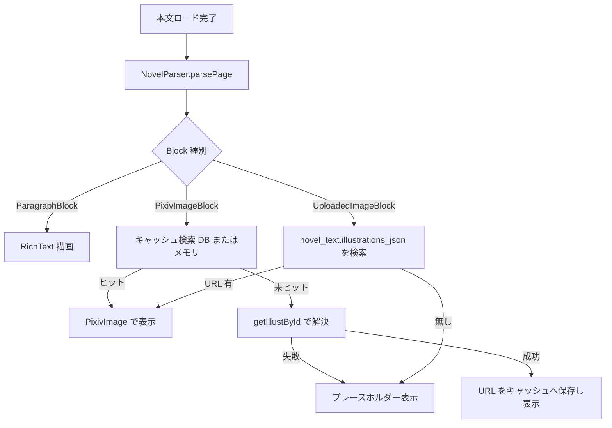
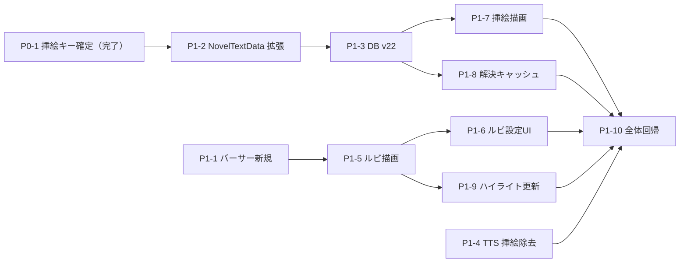

# 09 - 小説リッチレンダリング設計書（挿絵タグ・ルビ表示改善）

> ステータス: 設計確定（Phase 0 調査完了 — 挿絵キーは `textEmbeddedImages` に確定、詳細は [09-phase0-illustration-keys.md](09-phase0-illustration-keys.md)）
> 対象: PixEmber 小説リーダー（novel_reader_*.dart / novel_tts_service.dart / pixiv_api_service.dart）
> 本書はコード変更を伴わない設計ドキュメントである。

---

## 0. 目的とスコープ

| 目的 | 内容 |
|---|---|
| 1 | 本文の挿絵タグ `[uploadedimage:ID]` / `[pixivimage:ID]` / `[pixivimage:ID-page]` を画像として表示する |
| 2 | ルビ `[[rb:本文 > ルビ]]` の表示を改善し、本文が不自然に下へ押し下げられないようにする |

スコープ外: 章タイトル自動抽出、リンク/太字/斜体/傍点の本格対応、Web 版 novel viewer の完全再現。

---

## 1. 現状調査

### 1.1 本文取得処理

| 項目 | 現状 |
|---|---|
| API | `PixivApiService.getNovelText` が `/webview/v2/novel?id=...&viewer_version=20221031_ai` を GET |
| 抽出 | レスポンス HTML 中の `window.preloadData` 相当から正規表現 `novel:\s*(...)` で JSON を取り出し、`text` キーのみ使用 |
| 分割 | `text.split('[newpage]')` → trim → `NovelTextData(id, novelText, novelPages)` |
| キャッシュ | `novel_text` テーブル（work_id PK / pages_json / text / title / author_name / updated_at）。`DatabaseService.saveNovelTextCache` 系で UPSERT |

**重要な現状**: `getNovelText` は JSON `text` 以外を**すべて捨てている**。挿絵対応には JSON 追加キーの保持が必要（§9, §12）。Phase 0 の調査で挿絵マップの実キーは **`textEmbeddedImages`** と確定した（[Phase 0 報告書](09-phase0-illustration-keys.md) §3）。

### 1.2 本文パーサー

| 記法 | 現状の処理 | 場所 |
|---|---|---|
| `[newpage]` | `getNovelText` でページ分割済み。UI 側 `_formatParagraphs` でも二重除去 | pixiv_api_service.dart / novel_reader_ui_components.dart |
| ルビ `[[rb:親 > ルビ]]` | `_parseRubyText` が RegExp `\[\[rb:(.+?)\s*>\s*(.+?)\]\]` で逐一パースし WidgetSpan 化 | novel_reader_ui_components.dart:876-973 |
| 改ページ | PageController + ScrollController 配列でページ管理 | novel_reader_screen.dart |
| 章タイトル | 未対応（1 ページ目冒頭に作品タイトル+作者を固定表示） | novel_reader_ui_components.dart |
| リンク / 太字 / 斜体 / 傍点 | **未対応**（装飾タグは文字列のまま表示） | — |
| `[jump:N]` | TTS 側でのみ除去（表示はそのまま） | novel_tts_service.dart |
| 挿絵タグ | **未対応**（`[uploadedimage:...]` / `[pixivimage:...]` は本文に文字列のまま表示される） | — |

### 1.3 現在のルビ表示と「本文押し下げ」原因

現行実装（`_parseRubyText`）:

```text
WidgetSpan(alignment: PlaceholderAlignment.middle,
  child: Column(mainAxisSize: min,
    [ Text(rubyText, fontSize*0.5, height:1.0),
      Text(baseText, fontSize, height:1.0) ]))
```

原因の構造:

1. `WidgetSpan` が行内に置かれると、Flutter は child の**全高**を行ボックスに組み込む。
2. `PlaceholderAlignment.middle` は「行ボックスの中央」に child を置くため、Column 高さ = ルビ高 + 親文字高 となり、ルビを含む行の行ボックスだけが `fontSize * lineHeight + rubyHeight` に**伸びる**。
3. ルビを含む行だけ行間が大きくなり、後続行が**下へ押し下げられる**。
4. さらに `height: lineHeight(1.8)` の TextSpan と混在するため、伸び幅が視覚的に顕著になる。

ページング/しおりとの連動:

- しおりは `novel_page_{id}`（ページ番号）+ `novel_offset_{id}`（ページ内スクロール px）で保存。
- レイアウト変更（行高の変化）はページ内スクロールオフセットの**実質位置**をずらすが、ページ番号単位のしおり復帰は壊れない。ページ内オフセット復帰は多少ずれることを設計で許容（§7）。既存ロジックは clamp 済みで破綻しない。

### 1.4 TTS 正規化

- `novel_tts_service.dart` の `normalizeNovelTextForSpeech(raw, readRuby)`:
  - `_rubyPattern` で `readRuby=true → ルビ側 / false → 親文字側` に置換（**ルビは既に読み上げ対応済み**）
  - `[newpage]` / `[jump:N]` を除去
- 挿絵タグ（uploadedimage / pixivimage）は**未除去** → 読み上げテキストに `[pixivimage:123]` が混入する問題が潜在。本設計で併せて修正する（§8）。
- チャンクは `TtsChunk(pageIndex, startOffset, text)` で元本文位置を保持。表示と読み上げは独立して成立（表示を親文字にするのは既存の `readRuby=false` 相当）。

---

## 2. 挿絵タグ仕様調査

### 2.1 本文での出現形

| タグ | 意味 | 例 |
|---|---|---|
| `[uploadedimage:ID]` | 作者が小説投稿時に直接アップロードした挿絵。ID は小説ごとに振られるローカル ID | `[uploadedimage:1234567]` |
| `[pixivimage:ID]` | 作者の**イラスト投稿**（/artworks/ID）を参照。1 ページ目のみ参照 | `[pixivimage:98765432]` |
| `[pixivimage:ID-page]` | 同イラストの `page` 番目を参照 | `[pixivimage:98765432-1]` |

### 2.2 ページ番号の始まり（重要）

**pixiv 公式仕様により `[pixivimage:ID-page]` の page は 0 始まり**である（`0` = 1 枚目）。ただし作者が誤って 1 始まりで書くケースが実在するため、実装では:

- `page` が指定あり → 0 始まりで解釈
- 解決したイラストの `pageCount` を越える場合のみ、1 始まり再解釈のフォールバックを 1 回試行（`pageCount > page` 判定）

> 注: 本項はコードで確認可能な仕様ではなく pixiv Web viewer の外部仕様に基づく。Phase 1 冒頭の実データ検証（§12）で本文サンプルを用いて確認する。

### 2.3 uploadedimage の ID → URL 解決源の所在（Phase 0 で確定）

| 調査対象 | 結論 |
|---|---|
| `getNovelText` | JSON 抽出後に `text` のみ使用。**挿絵マップは現在破棄されている**。挿絵マップの実キーは **`textEmbeddedImages`**（Map: 本文タグの ID → `{novelImageId, sl, urls{5 sizes}}`）と確定（[Phase 0 報告書](09-phase0-illustration-keys.md) §3）。webview 応答への同梱は Phase 1 冒頭に kDebugMode ログで再確認（無ければ `/ajax/novel/{id}` からフォールバック取得） |
| `getNovelById`（/v2/novel/detail） | 挿絵 URL 情報を持たない（coverUrl のみ） |
| `meta_json` | novel_text テーブルに meta_json 相当の列は存在しない（§9 で追加） |
| `/ajax/novel/{id}`（Web 版） | **未認証で HTTP 200**。`body.content`（webview の novel.text と同一データ源・`[newpage]` 分割仕様も同一）+ `body.textEmbeddedImages` を含む。未ログインだと `/webview/v2/novel` が 404 のため、デバッグ用フォールバックとして利用可能 |

### 2.4 pixivimage の ID → URL 解決

pixivimage は参照先が通常イラスト投稿のため、既存 API で確実に解決できる:

- `PixivApiService.getIllustById(id)` → `/v1/illust/detail`
- 1 ページ作品: `meta_single_page.original_image_url`
- 複数ページ作品: `meta_pages[page].image_urls.original`
- 表示は既存 `PixivImage`（Referer / UA 付き、`localFile` 優先、errorWidget 対応）をそのまま再利用可能

### 2.5 既存資産の再利用可否

| 資産 | 再利用 | 備考 |
|---|---|---|
| [`PixivImage`](pixiv_viewer/lib/widgets/pixiv_image.dart) | ✅ | Referer 必須の pximg を正しく取得。`localFile` 優先でオフライン表示も可能 |
| `PixivHttpHeaders.image` | ✅ | DownloadService と同一ヘッダー |
| `DownloadService` | ✅ | illust 単位のキュー（work_type='illust'）を流用（pixivimage の元作品登録用。§10） |
| `ZoomableImage` | ✅ | タップ拡大ビューにそのまま使用 |
| `sqflite novel_text` | ✅ | `illustrations_json` 列を追加（§9） |

### 2.6 オフライン時の挿絵表示

- `PixivImage(localFile: ...)` が既にローカルファイル優先 → ダウンロード済みファイルパスを解決できればオフライン表示は自然に成立する（pixivimage のみ Phase 1 時点で対象。uploadedimage は Phase 2）
- 未ダウンロード時は `errorWidget` でプレースホルダー表示（§5.4）

---

## 3. レイアウト方針の比較

### 3.1 案A〜D の比較

| 観点 | 案A 現状維持<br>Column+middle 押し下げ | 案B 基準線維持+<br>上に固定ルビ余白 | 案C 行ごと可変上余白 | 案D WebView ruby |
|---|---|---|---|---|
| 実装難易度 | 最低（変更なし） | 低〜中 | 高（行レベル解析・TextPainter 測定が必須） | 高（WebView 導入・HTML 変換） |
| 既存リーダーへの影響 | 問題が残る | 小 | 中（ページング計算・検索ハイライトに波及） | 大（スクロール/ページング/検索/TTS UI 連携を全再設計） |
| ページング/しおり | 影響なし | 影響小 | ルビ行の有無で行高が変わり offset が不安定化 | 影響なし（WebView 内部）だが**ページ分割と両立困難** |
| TTS との相性 | 影響なし | 影響なし | 影響なし | 位置同期が不可能に近い |
| 見た目 | ルビ行だけ間延び | 文庫本風で安定 | 理想に近いが複雑 | 最も正確（公式と同等） |
| Android/Desktop/Web | ✅ | ✅ | ✅ | ⚠️ Web/Desktop は webview_flutter 未対応 → **プラットフォーム分岐必須** |

### 3.2 案B'（WidgetSpan はみ出し方式）と案B''（段落単位行送り揃え方式）の比較

案B を実装する形態として、以下の 2 方式を比較した。

**案B'（WidgetSpan + Stack + Positioned + SizedBox）**:

- 親文字と同高の SizedBox 内に Stack を置き、ルビを上方向にはみ出し描画する
- この方式には次の実装リスクがある:
  1. Positioned を SizedBox の外へはみ出させるには `Stack(clipBehavior: Clip.none)` が必須だが、これはフォールバック扱いでメイン方式として不安
  2. 親文字の推定幅を `fontSize * base.length * 係数` で計算すると、日本語・英字・記号混在で必ずズレ、ルビと親文字の左右がずれる
  3. WidgetSpan の描画領域の外にはみ出す挙動は、フォント・OS 環境で不安定になる可能性がある

**案B''（段落単位で行送りを揃える方式）**:

- ページ全体は段落 Widget 列にする
- ルビを 1 つでも含む段落（ルビ段落）は、段落内の**全行の行送りを (ルビ高 + 親文字高) に統一**する
- ルビ無し段落は従来の行送りのまま
- 「行ボックスをはみ出させる」処理が不要になり、親文字の推定幅計算も不要になる

| 観点 | 案B' はみ出し方式 | 案B'' 段落単位行送り揃え |
|---|---|---|
| 実装難易度 | 中（幅推定・Clip.none・baseline 調整が必要） | **低**（既存 RichText + WidgetSpan 構造を維持し、行送り計算の追加のみ） |
| 見た目 | 幅推定ズレでルビと親文字の左右がずれるリスク | **ルビ段落内は全行同一段送りで一貫。文庫本風の見た目が成立** |
| 幅計算 | **必須**（フォント混在で必ずズレる） | **不要**（Column が intrinsic 幅で中央寄せ） |
| はみ出し描画 | **必須**（フォント・OS 依存の不安定要素） | **不要** |
| 折り返し | RichText 標準折り返し（安全） | RichText 標準折り返し（安全）※実装形態は §3.3 参照 |
| しおり・ページング・検索への影響 | 行高不変で影響最小 | ルビ段落の行送りが fontSize×0.55 程度増 → ページ内 extent が変動（既存 clamp で安全。§7） |
| テストのしやすさ | はみ出し描画の Widget 検証は困難 | **行送り値・段落高の計算テストで容易** |
| 日本語混じり文での安全性 | **低**（幅推定が全角/半角混在で破綻） | **高**（幅計算が存在しない） |

### 3.3 結論: 案B'' をメイン方式に採用

案B'' のほうが安全性・テスト容易性・日本語混在文での堅牢性で明確に優れるため、**メイン方式を案B'' とする**。

実装形態には 2 つの候補があり、**RichText の行送り拡張方式（B''-a）を採用**する:

| 候補 | 内容 | 判断 |
|---|---|---|
| B''-a: 行送り拡張 RichText | ルビ段落のみ RichText のベース style.height を拡張し、既存の WidgetSpan + Column（middle）構造をそのまま流用する | **採用**。Flutter 標準の折り返しを維持したまま「段落単位で行送りを揃える」要件を満たす |
| B''-b: Wrap 子列方式 | 段落を Wrap で構成し、ルビ部分は Column（ルビ+親文字）、他は Text を並べる | 不採用。RenderWrap は長いテキスト断片を 1 子として扱うため、断片が折り返して高くなるとルビ位置で**強制改行**が発生する。これを避けるには TextPainter による行分割の事前計算が必要になり、案C と同等の複雑さに戻る |

B''-a の詳細は §6.1 に記載する。

案D はページング・TTS・検索と両立しないため不採用。

---

## 4. パーサー設計（追加する構造）

新規ファイル `lib/services/novel_parser.dart`（UI 非依存・純粋 Dart・単体テスト対象）。

### 4.1 ブロックモデル

```dart
/// ページ本文を解析した結果の構造単位（sealed）
sealed class NovelBlock {}

/// 通常段落。rubyToken 化された InlineRun 列を持つ
class ParagraphBlock extends NovelBlock {
  final List<InlineRun> runs; // 通常文字列 or RubyInline
}

/// [uploadedimage:ID]
class UploadedImageBlock extends NovelBlock {
  final String localId;     // タグ中の ID（uploadedImages マップのキー）
  final int pageIndexInPage; // 同一ページ内の出現順（複数挿絵対応）
}

/// [pixivimage:ID] / [pixivimage:ID-page]
class PixivImageBlock extends NovelBlock {
  final int illustId;
  final int? page;          // 0 始まり。省略時 null（=0 扱い）
}

/// [newpage]（ページ分割は getNovelText 済みだが、仕様上 parse 経路でも許容）
class PageBreakBlock extends NovelBlock {}
```

### 4.2 インラインモデル

```dart
/// 段落内の1要素
sealed class InlineRun {}

/// 装飾の無い通常テキスト
class PlainText extends InlineRun {
  final String text;
}

/// [[rb:親文字 > ルビ]]
class RubyInline extends InlineRun {
  final String base;  // 親文字（表示はこちら）
  final String ruby;  // ルビ（上に小さく表示 / TTS は readRuby で選択）
}
```

### 4.3 パーサー API

```dart
class NovelParser {
  /// 1 ページ分の本文をブロック列へ変換（純粋関数）
  static List<NovelBlock> parsePage(String pageText);

  /// 段落を InlineRun 列へ変換（純粋関数・パーサー内部用だがテストのため公開）
  static List<InlineRun> parseInline(String paragraphText);

  /// 本文全体から挿絵参照を抽出（オフライン事前解決用）
  static List<PixivImageBlock> collectPixivImages(String fullText);
}
```

解析規則:

1. 段落分割: `\n` 区切り（連続空行は 1 つの空段落に圧縮=既存 `_formatParagraphs` の意図を継承）
2. 行頭〜行末が完全一致で挿絵タグのみ → 独立ブロック化（インライン混在のタグも文字列として許容するが、pixiv 慣行上は単独行）
3. `[[rb:...]]` は行内どこでも可。ネスト・複数出現に対応（非貪欲マッチの逐次適用）
4. 不明タグ（`[jump:N]` 等）は `PlainText` として温存（TTS 側の既存除去と整合）
5. トークン境界: `containsR18Token` で採用した「文字列境界マッチ」の考え方を踏襲し、`[pixivimage:1]abc` のような変形は誤爆しない

---

## 5. 挿絵タグの解決方法

### 5.1 解決フロー



### 5.2 uploadedimage の解決

1. `getNovelText` が webview JSON から **`textEmbeddedImages`**（Phase 0 確定、[報告書](09-phase0-illustration-keys.md) §3）を抽出し `Map<String, String>`（localId → URL）として返す。webview 応答に同キーが無い場合は `/ajax/novel/{id}` からフォールバック取得する
2. `NovelTextData` に `illustrations` フィールドを追加（既存 fromJson は後方互換: キー無しなら空マップ）
3. リーダーは `UploadedImageBlock.localId` でマップを引き、URL があれば `PixivImage(url)` 表示
4. **Phase 1 はオンライン表示のみ**（オフライン化は Phase 2、§15 の確定記録参照）。**ブロッカー時の退避**（§13）: マップが取れない場合はプレースホルダー + タグ文字列を小さく併記

### 5.3 pixivimage の解決

1. `PixivImageBlock.illustId` でメモリキャッシュ → DB キャッシュ（`illustrations_json` に併記）→ `getIllustById` の順に解決
2. 解決後、`metaPages[page].original`（page 省略時は `urls.original`）を表示 URL とする
3. `page` 越過時の 1 始まりフォールバックは §2.2 のとおり 1 回のみ
4. 取得した `Illust` はメモリキャッシュ（LRU 相当、上限 20）に保持し、同一エピソード再表示で API を叩かない

### 5.4 解決不能時のプレースホルダー

```text
┌──────────────────────────┐
│        🖼️  挿絵           │
│  （画像を読み込めません）  │
│  タップして再読み込み       │
└──────────────────────────┘
```

- 表示条件: URL 解決失敗 / ネットワークエラー / R-18 制限等で API が返さない
- タップで再解決を試行。タップ長押しでタグ文字列を SnackBar 表示（デバッグ補助）
- 高さは画面幅の 4:3 を上限に固定し、ページング計算が暴れないようにする

---

## 6. ルビ表示方針

### 6.1 表示設計（案B'' / B''-a 行送り拡張 RichText）

| 要素 | 仕様 |
|---|---|
| 段落分類 | パーサー結果の ParagraphBlock の runs に RubyInline が 1 つ以上含まれる段落を「ルビ段落」とする |
| ルビ段落の行送り | RichText のベース style.height を `rubyLineHeightRatio` に拡張する。WidgetSpan（PlaceholderAlignment.middle）+ Column（ルビ, 親文字）は既存 `_parseRubyText` の構造を**そのまま流用**する |
| rubyLineHeightRatio | `lineHeight + rubyFontSize / fontSize + 呼吸分0.05`。rubyFontSize = fontSize × 0.5 のため初期値は **lineHeight + 0.55**。fontSize=18 / lineHeight=1.8 の場合 height ≈ 2.35 → 行送り約 42.3px（通常段落 32.4px）。実機で微調整 |
| 非ルビ段落 | 従来どおり height: lineHeight。**行送りは 1px も変わらない** |
| 幅計算 | 不要（Column が親文字の intrinsic 幅で中央寄せ。全角/半角/記号混在でもズレない） |
| はみ出し描画 | 不要（Stack + Clip.none を廃止） |
| 段落構造 | 1 ページ = 段落 Widget 列（Column）。段落内は 1 RichText（折り返しは Flutter 標準動作に任せる） |
| 検索ハイライト | 既存の `_searchQuery` 黄色ハイライトは `PlainText.runs` にも適用（RichText の TextSpan backgroundColor） |
| 横書き前提 | 縦書きはスコープ外 |
| 間延びの緩和 | 長いルビ段落は全行が広行送りになるトレードオフがある。Phase 2 で文区切りサブ段落化を検討（Phase 1 はそのまま。文庫本風の見た目は段落単位の行送りで成立する） |

### 6.2 ルビ表示設定（Phase 1 に含める・最小 UI）

| 設定 | 値 | 既定 | 実装 Phase |
|---|---|---|---|
| ルビ表示モード | show / brackets / hide | show | 1 |
| 保存先 | `SharedPreferences.novel_pref_ruby_mode` | show | 1 |
| UI | 設定画面の 1 項目のみ（SegmentedButton または Dropdown の最小構成） | — | 1 |
| 将来の拡張 | `tts_priority`（表示は親文字、読み上げはルビ）を enum 値の追加で対応可能な設計にする | — | 未定（余地のみ確保） |

- `show`: ルビを親文字の上に小さく表示（本設計の標準描画）
- `brackets`: 親文字の後ろに括弧でルビをインライン表示（例: 颯（はやて））
- `hide`: `PlainText(base)` に畳む（TTS の `readRuby=false` と見た目が一致）

---

## 7. ページング・しおり・検索との整合

| 機能 | 影響 | 対策 |
|---|---|---|
| ページ分割 | なし | `[newpage]` は従来どおり `getNovelText` で分割。ブロック化はページ内のみ |
| しおり（ページ番号） | なし | ページあたりの内容は変わらない（ルビ段落の行送り増はページ内の extent に影響する程度） |
| しおり（ページ内 offset） | 微影響 | 案B'' ではルビ段落の行送りが fontSize×0.55 程度増えるためページ内 extent が変動する。既存ロジックの `clamp` により復帰自体は安全。しおり精度のフィードバックは Phase 2 で収集 |
| ページ内検索 | 保持 | `PlainText.text` にハイライトを適用。挿絵ブロックは検索対象外 |
| 自動スクロール | なし | ScrollController 単位はページごとのため影響なし |
| ページウィジェットキャッシュ | 更新必要 | `_cachedPages` 破棄キー（`_cachedPagesSignature`）に「ルビ設定 + 本文バージョン」を加算 |

---

## 8. TTS との連携

| 項目 | 仕様 |
|---|---|
| 表示 | 親文字（`RubyInline.base`） |
| 読み上げ | 既存設定 `_ttsReadRuby` に従う（true=ルビ / false=親文字）。ロジック変更なし |
| 挿絵タグ | `normalizeNovelTextForSpeech` に除去パターンを追加: `\[uploadedimage:\d+\]` と `\[pixivimage:\d+(?:-\d+)?\]`（caseSensitive: false）。**本文のみの変更で表示モデル非依存**にするため、TTS 経路は NovelBlock を使わず現行の文字列正規化を維持する |
| 整合性テスト | `parsePage → runs → join` の親文字列が `normalizeNovelTextForSpeech(readRuby: false)` と（挿絵タグ・空行差分を除き）一致することをテストで担保 |

---

## 9. DB 変更の要否

### 9.1 結論: `novel_text` への列追加（新テーブル不要）

| 案 | 判断 |
|---|---|
| A. 新テーブル `novel_illustrations` | 不採用。挿絵は本文と同一ソース（webview JSON）から得られ、寿命も本文と同一。テーブル分割の利益が薄い |
| B. `novel_text.illustrations_json` 列追加 | **採用**。`ALTER TABLE novel_text ADD COLUMN illustrations_json TEXT`（NULL=旧データ、JSON は `Map<String,String>` の encode） |

### 9.2 マイグレーション方式: DB バージョン明示アップ（v22）

**遅延追加（`_ensureNovelTextColumns` 方式）は使わない。** 既存の非破壊マイグレーションと同じ流儀で `onUpgrade` に追加する:

1. DB バージョンを **v22** に明示アップする（現行バージョンが v21 未満の場合は連番で順次上げ、v22 で illustrations_json を追加する）
2. `onUpgrade` に `ALTER TABLE novel_text ADD COLUMN illustrations_json TEXT` を追加（既存の列存在チェックヘルパーによる冪等化は許容）
3. バックアップ対象テーブルの列一覧（Google Drive バックアップ/復元の `novel_text` スキーマ定義）にも `illustrations_json` を追加する
4. 新規インストール時の `onCreate` にも同列を含める

実装上の注意:

- pixivimage の**解決済み illustId → original URL** も同一列に `"pixiv:{illustId}:{page}": "https://..."` 形式で併記し、再表示時の API 呼び出しを省略（TTL は設けない。URL 失効時は表示エラー→再解決で自己修復）
- uploadedimage は **`"uploaded:{uploadedimageId}": url`** 形式で格納する（Phase 0 確定の `textEmbeddedImages` キーから抽出。[報告書](09-phase0-illustration-keys.md) §6）

---

## 10. オフライン対応

### 10.1 DownloadService への載せ方

| 方式 | 内容 | 判断 |
|---|---|---|
| 挿絵を illust として個別 enqueue | `enqueueIllust` を pixivimage 元イラストに適用。既存キュー UI にそのまま出る | **採用**（pixivimage の元作品は通常イラストのため自然。重複登録は既存 `findDownloadQueueGroup` が吸収） |
| novel グループの子アイテム化 | work_type='novel_illustration' 新設 | 不採用。キュー UI・進捗・削除ロジックの改修が膨らむ |

- `enqueueNovel` 時に `NovelParser.collectPixivImages(fullText)` を実行し、参照イラストを `enqueueIllust(Illust)` に登録（優先度は novel と同じ）
- **uploadedimage は Phase 2 に回す**（§15 確定記録）。uploadedimage は illust オブジェクトを持たないため、DownloadService に `enqueueSingleImage(novelId, localId, url, workType: 'novel_illustration')` 的な新仕様の設計と実装が別途必要。Phase 1 は**オンライン表示のみ**
- ローカルファイルパスの解決は既存の downloaded_illusts / ダウンロードディレクトリ命名規則に依存。pixivimage の場合は illust ダウンロード済みなら `PixivImage(localFile:)` で自動オフライン表示

### 10.2 画像未取得時の表示

| 状態 | 表示 |
|---|---|
| オンライン + URL 解決成功 | 通常表示（リサイズ: 幅 = ページ幅、高さ上限 = 画面高の 60%） |
| ダウンロード済み（pixivimage） | `PixivImage(localFile:)` |
| 未取得・オフライン | プレースホルダー（§5.4）＋「オフラインのため未表示」のサブテキスト |
| タップ | オンライン時は `ZoomableImage` へ遷移 |

---

## 11. テスト計画

### 11.1 パーサーテスト（`test/novel_parser_test.dart` 新規）

| グループ | ケース |
|---|---|
| parsePage 基本 | 段落分割 / 連続空行圧縮 / `[newpage]` で PageBreakBlock |
| RubyInline | 単一ルビ / 同一行複数ルビ / 親文字に括弧を含む `[[rb:魔女(まじょ) > まじょ]]` 風の入れ子括弧 / 空ルビは親文字のみへ畳む |
| UploadedImageBlock | `[uploadedimage:123]` 単独行 / 行中混在でもブロック化 / 無効 ID（非数値）は PlainText |
| PixivImageBlock | `[pixivimage:9]` page=null / `[pixivimage:9-0]` page=0 / `[pixivimage:9-3]` page=3 / 負数・非数値は PlainText |
| collectPixivImages | 複数ページ・重複 illustId の dedupe / page 差分は別要素 |

### 11.2 ルビ表示用モデル・行送りテスト（案B'' 採用に伴う追加）

- `RubyInline` の base/ruby 分離
- **`rubyLineHeightRatio` の計算式テスト**: `lineHeight + rubyFontSize / fontSize + 0.05` が期待値になること（fontSize=18 / lineHeight=1.8 → 2.35）
- **ルビ有無による行送り切替テスト（Widget テスト）**: RubyInline を含む段落は拡張行送りの RichText、含まない段落は従来 `lineHeight` の RichText になること
- **非ルビ段落の行送り不変テスト**: ルビを含まない段落の TextStyle.height が現行値から 1px も変わらないこと
- ルビ設定 `show/brackets/hide` で InlineRun の畳み込みが正しいこと

### 11.3 uploadedimage / pixivimage テスト

- `illustrations_json` の encode/decode 往復
- `NovelTextData.fromJson` 旧形式（キー無し）で空マップになる後方互換
- page 越過フォールバックの 1 始まり再解釈ロジック（純粋関数として切り出す）

### 11.4 TTS 正規化との整合

- `normalizeNovelTextForSpeech` が `[uploadedimage:1]` / `[pixivimage:1]` / `[pixivimage:1-0]` を除去する
- `readRuby=true/false` の既存テストが壊れない（novel_tts_test.dart 回帰）

### 11.5 Widget テスト

- ルビ段落と非ルビ段落が混在するページで、非ルビ段落の行間が変わらないこと（段落間行送りの目視確認を自動化）
- 挿絵プレースホルダーがエラー時に表示されること（フォールバック URL 無効）
- ルビ設定 hide 時に WidgetSpan が生成されないこと

---

## 12. Phase 0: 挿絵キー確定調査（プレ調査）【完了】

実装フェーズとは切り離した独立タスクとする。**Phase 0 が完了するまで Phase 1 の実装は開始しない。**

| 項目 | 内容 |
|---|---|
| 状態 | **完了**（2026-09-01）。調査方法・結果の詳細は [09-phase0-illustration-keys.md](09-phase0-illustration-keys.md) を参照 |
| 調査方法 | トークン不使用の方針のため、まず未認証 `/webview/v2/novel` を生取得したが**実在作品でも一様に HTTP 404** で取得不可と判明。代替として Web 版公開エンドポイント **`GET /ajax/novel/{id}`（未認証 OK）** を使用し、`body.content`（webview の novel.text と同一データ源・`[newpage]` 分割仕様も同一）と挿絵マップを取得した |
| 結果 | **uploadedimage: キー名 `textEmbeddedImages` で確定**。Map（本文タグ `[uploadedimage:N]` の N と完全一致照合済み）→ `{novelImageId, sl, urls{128x128, 240mw, 480mw, 1200x1200, original}}`。original は Referer+UA 付きで**未認証取得可**（HTTP 200 / image jpeg・png 実測）。**pixivimage: illustId→URL マップは応答のどこにも存在しない**（全トップレベルキー走査で裏取り済み）→ 既存設計 §5.3（getIllustById による個別解決）が正しいことが確定 |
| 残タスク | webview 応答（ログイン状態）にも同一キー `textEmbeddedImages` が同梱されるかは Phase 1 冒頭の実装時に kDebugMode ログで 1 回だけ再確認する。無い場合は `/ajax/novel/{id}` からフォールバック取得する（§5.2 に反映済み） |
| Phase 1 への影響 | uploadedimage は「プレースホルダー限定」から**リッチ表示可能**に格上げ（§5.2）。P1-2 の抽出キー名は `textEmbeddedImages` に確定。キャッシュ形式 `"uploaded:{id}": url`（§9.2） |

---

## 13. 実装ブロッカー

### 13.1 uploadedimage ID → URL の取得源が実装時点で未確定【解消】

- **解消（Phase 0 完了）**: 挿絵マップのキー名は **`textEmbeddedImages`** と確定した（[Phase 0 報告書](09-phase0-illustration-keys.md) §3・§5）。webview は未ログインだと 404 のため未認証生取得は不可能だったが、Web 版 `/ajax/novel/{id}`（未認証 OK、webview と同一の本文データ源）でキー構造の確認と本文タグ ID との完全一致照合まで実施した
- **残置（Phase 1 冒頭・軽微）**: webview 応答（ログイン状態）への同キー同梱の最終確認のみ、Phase 1 実装時に kDebugMode ログで 1 回実施する。無い場合は `/ajax/novel/{id}` からフォールバック取得するため Phase 1 の要件は縮小されない
- 旧退避案 1（プレースホルダー限定）・2（pixivimage のみリッチ表示）は**不要と確定**。3（`NovelIllustrationResolver` 抽象）はフォールバック経路の実装先として活用する

### 13.2 挿絵専用 CDN のヘッダー

- `i.pximg.net/img-novel/...` 系は既存 `PixivHttpHeaders.image`（Referer 付き）で取得可能と想定。403 時は `PixivImage.errorWidget` に自然に落ちるため、初期実装で追加工作は不要

### 13.3 段落行送りによるページング extent 変動

- 案B'' ではルビ段落の行送りが増えるためページ内 extent が伸びる。しおり offset は clamp 済みで破綻しないが、初回リリース後にしおり精度のフィードバックを収集し、必要なら「offset を行単位から段落 index に変更」する Phase 2 改善を検討

---

## 14. 実装フェーズ計画

### Phase 0（プレ調査）

| # | タスク | 依存 |
|---|---|---|
| P0-1 | webview JSON 挿絵キー確定調査（§12）**【完了】**キー名 `textEmbeddedImages` 確定（[報告書](09-phase0-illustration-keys.md)） | — |

### Phase 1（本体実装）

| # | タスク | 依存 |
|---|---|---|
| P1-1 | `novel_parser.dart` 新規（NovelBlock / InlineRun / NovelParser）+ テスト | — |
| P1-2 | `NovelTextData` に `illustrations` 追加、`getNovelText` が `textEmbeddedImages`（P0-1 確定）を保持。webview 同梱確認を kDebugMode ログで実施（無ければ `/ajax/novel/{id}` フォールバック） | P0-1（完了） |
| P1-3 | DB v22: `novel_text.illustrations_json` 列 + onUpgrade + バックアップ列一覧更新 | P1-2 |
| P1-4 | TTS 正規化に挿絵タグ除去追加 + 回帰テスト | — |
| P1-5 | ルビ描画を案B''（行送り拡張 RichText）に置換 + 行送りテスト | P1-1 |
| P1-6 | ルビ表示設定 UI（最小 1 項目: `novel_pref_ruby_mode` / show / brackets / hide、既定 show） | P1-5 |
| P1-7 | 挿絵ブロック描画（オンライン表示: PixivImage / ZoomableImage / プレースホルダー / タップ再読込） | P1-2, P1-3 |
| P1-8 | pixivimage 解決キャッシュ（メモリ LRU + illustrations_json） | P1-3 |
| P1-9 | 検索ハイライト・ページキャッシュ署名の更新 | P1-5 |
| P1-10 | flutter analyze / flutter test 全体回帰 | 全て |

### Phase 2（拡張）

| # | タスク | 依存 |
|---|---|---|
| P2-1 | uploadedimage のオフライン化（enqueueSingleImage の設計と実装） | P1-7 |
| P2-2 | 長いルビ段落の文区切りサブ段落化（間延び緩和） | P1-5 |
| P2-3 | しおり精度フィードバックに基づく offset 方式の見直し | P1-10 |



---

## 15. 設計判断の確定記録

| 判断 | 確定内容 | 根拠 |
|---|---|---|
| uploadedimage のオフライン化 | **Phase 2 に回す。Phase 1 はオンライン表示のみ** | uploadedimage は illust オブジェクトを持たず DownloadService の既存キュー（work_type='illust'）に乗らないため、新仕様の設計と実装が別途必要 |
| ルビ表示設定 UI | **Phase 1 に含める。設定画面の 1 項目のみの最小構成** | `SharedPreferences.novel_pref_ruby_mode`（show / brackets / hide）、既定 show。将来の TTS 優先モード（表示=親文字、読み上げ=ルビ）を enum 値の追加で対応できる余地を保持 |
| illustrations_json の列追加方式 | **DB バージョン明示アップ（v22）。遅延追加（_ensureNovelTextColumns）は使わない** | onUpgrade に非破壊マイグレーションとして追加し、既存のバージョン管理の流儀に統一。バックアップ対象テーブルの列一覧にも illustrations_json を追加 |
| ルビ表示方式 | **案B''（行送り拡張 RichText / B''-a）をメインに採用** | 案B' の 3 リスク（Clip.none 必須・幅推定ズレ・はみ出しの環境依存）を排除し、テスト容易性と日本語混在文での堅牢性が優れる（§3.2, §3.3） |